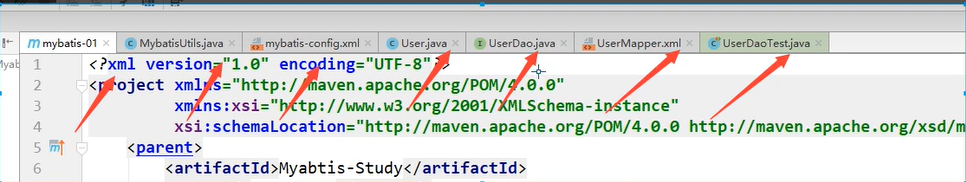
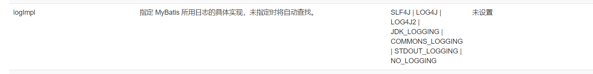
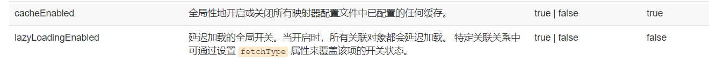
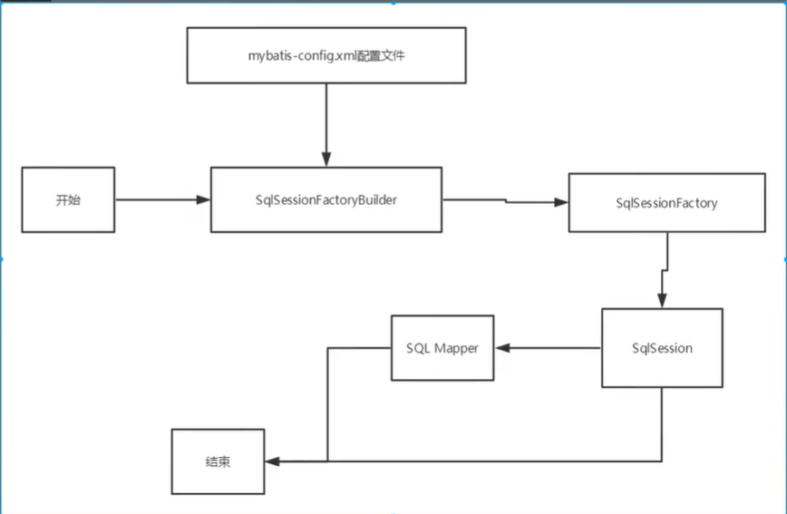
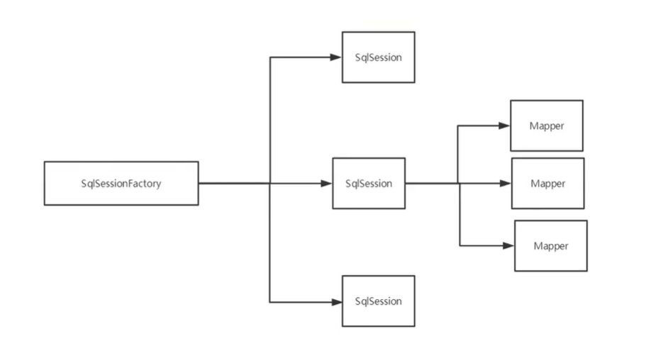
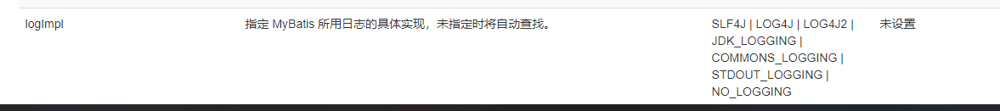
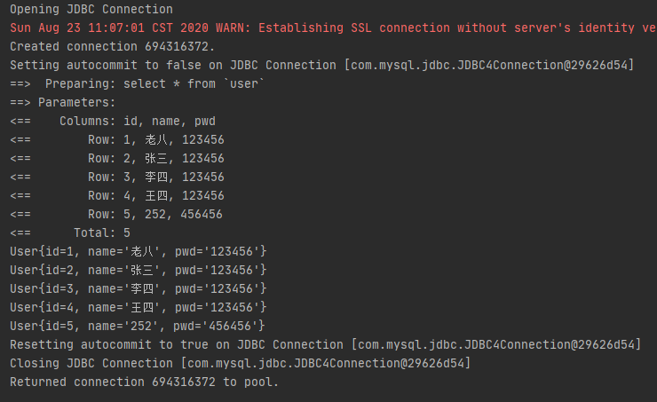
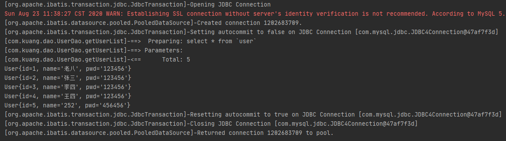

# Mybatis

环境：

-   JDK1.8
-   Mysql5.7
-   maven3.6.1
-   IDEA

回顾

-   JDBC
-   Mysql
-   Java基础
-   Maven
-   Junit


SSM框架：配置文件的。 

最好的学习方式，学习官方文档

# 1.简介

## 1.1 什么是Mybatis

-   MyBatis 是一款优秀的**持久层框架**
-   它支持自定义 SQL、存储过程以及高级映射
-   MyBatis 免除了几乎所有的 JDBC 代码以及设置参数和获取结果集的工作。
-   MyBatis 可以通过简单的 XML 或注解来配置和映射原始类型、接口和 Java POJO（Plain Old Java Objects，普通老式 Java 对象）为数据库中的记录。
-   2013年11月迁移至Github


如何获得Mybatis？

-   Maven仓库

    ```xml
    <!-- https://mvnrepository.com/artifact/org.mybatis/mybatis -->
    <dependency>
        <groupId>org.mybatis</groupId>
        <artifactId>mybatis</artifactId>
        <version>3.5.2</version>
    </dependency>
    ```

-   Github：https://github.com/mybatis/mybatis-3

-   中文文档：https://mybatis.org/mybatis-3/zh/index.html


## 1.2 什么是持久化

数据持久化

-   持久化就是将程序的数据从持久状态和瞬时状态转化的过程
-   内存： **断电即失**
-   数据库（JDBC）， IO文件持久化
-   生活：冷藏、罐头


**为什么需要持久化？**

-   有一些对象，不能让他丢失
-   内存价格昂贵，硬盘便宜


## 1.3 持久化

Dao层、Service层，Controller层…

-   完成持久化工作的代码块
-   层与层之间的界限非常明显


## 1.4 为什么需要Mybatis？

-   帮助程序员将数据存入数据库。

-   方便
-   传统的JDBC代码过于复杂，所以出现了框架对原有的编码方式进行简化------》 自动化
-   不用Mybatis也可以，更容易上手。**技术没有高低之分**
-   优点：
    -   简单易学
    -   灵活
    -   sql和代码分离，提高可维护性
    -   提供映射标签，支持对象与数据库的orm字段关系映射
    -   提供对象关系映射标签，支持对象关系组建维护
    -   提供xml标签，支持编写动态sql


**最重要的一点：使用人数多，生态氛围良好**

Spring SpringMVC SpringBoot


# 2. 第一个Mybatis程序

思路： 搭建环境 --》 导入Mybatis --》 编写代码 ---》 测试！



## 2.1 搭建环境

搭建数据库

```sql
CREATE DATABASE `mybatis`;

USE `mybatis`;

CREATE TABLE `user`(
	`id` INT(20) PRIMARY KEY NOT NULL;
	`name` VARCHAR(30) DEFAULT NULL;
	`pwd` VARCHAR(30) DEFAULT NULL;
)ENGINE=INNODB DEFAULT CHARSET=utf8;

INSERT INTO `user` (`id`, `name`, `pwd`) VALUES
	(1, '老八', '123456'),
	(2, '张三', '123456'),
	(3, '李四', '123456'),
```


新建项目

1.  新建一个普通的maven项目

2.  删除src目录（将该文件作为父工程）

3.  导入maven依赖

    ```xml
    <dependencies>
    <!--    mysql驱动-->
        <dependency>
            <groupId>mysql</groupId>
            <artifactId>mysql-connector-java</artifactId>
            <version>5.1.47</version>
        </dependency>
    <!--    mybatis-->
        <dependency>
            <groupId>org.mybatis</groupId>
            <artifactId>mybatis</artifactId>
            <version>3.5.2</version>
        </dependency>
    <!--    junit-->
        <dependency>
            <groupId>junit</groupId>
            <artifactId>junit</artifactId>
            <version>4.12</version>
            <scope>test</scope>
        </dependency>
    </dependencies>
    ```


## 2.2 创建一个模块

-   编写mybatis的核心配置文件

    ```xml
    <?xml version="1.0" encoding="UTF-8" ?>
    <!DOCTYPE configuration
            PUBLIC "-//mybatis.org//DTD Config 3.0//EN"
            "http://mybatis.org/dtd/mybatis-3-config.dtd">
    <!--核心配置文件-->
    <configuration>
        <environments default="development">
    <!--    环境-->
            <environment id="development">
    <!--        事务管理-->
                <transactionManager type="JDBC"/>
                <dataSource type="POOLED">
                    <property name="driver" value="com.mysql.jdbc.Driver"/>
                    <property name="url" value="jdbc:mysql://localhost:3306/mybatis?userSSL=true&amp;useUnicode=true&amp;characterEncoding=UTF-8"/>
                    <property name="username" value="root"/>
                    <property name="password" value="123456"/>
                </dataSource>
            </environment>
        </environments>
        
    <!--    控制作用域，删掉作用与全局-->
    <!--    <mappers>-->
    <!--        <mapper resource="org/mybatis/example/BlogMapper.xml"/>-->
    <!--    </mappers>-->
    </configuration>
    ```

    

-   编写mybatis工具类

    ```java
    //sqlSessionFactory --> sqlSession
    public class MybatisUtils {
        private static SqlSessionFactory sqlSessionFactory;
        static{
            try {// 使用Mybatis第一步：获取sqlSessionFactory对象
                String resource = "mybatis-config.xml";
                InputStream inputStream = Resources.getResourceAsStream(resource);
                sqlSessionFactory = new SqlSessionFactoryBuilder().build(inputStream);
            } catch (IOException e) {
                e.printStackTrace();
            }
        }
    
        //既然有了 SqlSessionFactory，顾名思义，我们可以从中获得 SqlSession 的实例。SqlSession 提供了在数据库执行 SQL 命令所需的所有方法。
        // 你可以通过 SqlSession 实例来直接执行已映射的 SQL 语句
        public static SqlSession getSqlSession(){
            return sqlSessionFactory.openSession();
        }
    }
    ```


## 2.3 编写代码

-   实体类

    ```java
    public class User {
        private int id;
        private String name;
        private String pwd;
    
        public User(int id, String name, String pwd) {
            this.id = id;
            this.name = name;
            this.pwd = pwd;
        }
    
        public User() {
        }
    
        public int getId() {
            return id;
        }
    
        public void setId(int id) {
            this.id = id;
        }
    
        public String getName() {
            return name;
        }
    
        public void setName(String name) {
            this.name = name;
        }
    
        public String getPwd() {
            return pwd;
        }
    
        public void setPwd(String pwd) {
            this.pwd = pwd;
        }
    
        @Override
        public String toString() {
            return "User{" +
                    "id=" + id +
                    ", name='" + name + '\'' +
                    ", pwd='" + pwd + '\'' +
                    '}';
        }
    }
    ```

-   Dao接口

    ```java
    public interface UserDao {
        List<User> getUserList();
    }
    ```

-   接口实现类(由原来的UserDaoImpl文件转变为一个Mapper配置文件)

    ```xml
    <?xml version="1.0" encoding="UTF-8" ?>
    <!DOCTYPE mapper
            PUBLIC "-//mybatis.org//DTD Mapper 3.0//EN"
            "http://mybatis.org/dtd/mybatis-3-mapper.dtd">
    <!--nameSpace 绑定一个对应的Dao/Mapper接口-->
    <mapper namespace="com.kuang.dao.UserDao">
        <!--查询语句-->
        <select id="getUserList" resultType="com.kuang.pojo.User">
            select * from `user`
        </select>
    </mapper>
    ```

    


## 2.4 测试

**注意点：**

`org.apache.ibatis.binding.BindingException: Type interface com.kuang.dao.UserDao is not known to the MapperRegistry.`

```xml
<!--每一个Mapper.xml 都需要在Mybatis核心配置文件中注册-->
    <mappers>
        <mapper resource="com/kuang/dao/UserMapper.xml"/>
    </mappers>
```

**xml文件中不要有任何中文注释**

-   junit测试

    ```xml
        @Test
        public void test(){
            //第一步：获得SqlSession对象
            SqlSession sqlSession = MybatisUtils.getSqlSession();
            //方式一：执行SQL
            UserDao userDao = sqlSession.getMapper(UserDao.class);
            List<User> userList = userDao.getUserList();
            for (User user : userList) {
                System.out.println(user);
            }
    
            //关闭sqlSession
            sqlSession.close();
        }
    ```


可能会遇到的问题：

1.  配置文件没有注册
2.  绑定接口不对
3.  方法名不对
4.  返回类型不对
5.  Maven导出资源问题


# 3. CRUD

## 3.1 namespace

namespace中的包名要和Dao/Mapper接口的包名一致！

```xml
<mapper namespace="com.kuang.dao.UserDao">
   ....
</mapper>
```

## 3.2 select

选择，查询语句

```xml
<select id="getUserList" resultType="com.kuang.pojo.User">
	select * from `user`
</select>
```

-   id: 就是对应的namespace中的方法名；
-   resultType： sql语句执行的返回值！
-   parameterType：参数类型


1.  编写接口

    ```java
    //插入一个用户
    int addUser(User user);
    ```

2.  编写对应的mapper中的sql语句

    ```xml
    <select id="getUserById" resultType="com.kuang.pojo.User" parameterType="int">
        select * from `user` where id = #{id}
    </select>
    ```

3.  测试

    ```java
    @Test
    public void getUserById(){
        SqlSession sqlSession = MybatisUtils.getSqlSession();
    
        UserDao mapper = sqlSession.getMapper(UserDao.class);
        User userById = mapper.getUserById(1);
        System.out.println(userById);
    }
    ```

## 3.3 Insert

```xml
<insert id="addUser" parameterType="com.kuang.pojo.User">
    insert into `user` (`id`, `name`, `pwd`) value (#{id}, #{name}, #{pwd})
</insert>
```

## 3.4 Update

```xml
<update id="updateUser" parameterType="com.kuang.pojo.User">
    update mybatis.user set name = #{name}, pwd = #{pwd} where id = #{id}
</update>
```

## 3.5 Delete

```xml
<delete id="deleteUser" parameterType="int">
    delete from `user` where id=#{id}
</delete>
```


## 3.6 分析错误

-   写sql语句的xml文件中 不同的sql操作标签不要搞错（select标签中写insert！）
-   resources绑定 mapper，需要使用路径！ /分割，不是包名！
-   程序配置文件必须符合规范
-   NullPointerException错误，变量作用域问题。作用域要符合实际情况
-   输出的xml文件存在乱码问题，导致无法运行
-   Maven资源没有导出


## 3.7 万能Mapper

假设，实体类或者数据库的表、字段或者参数数量过多，我们可以考虑使用Map

```java
// 万能Map
int addUser1(Map<String, Object> map);
```

```xml
<insert id="addUser" parameterType="map">
    insert into `user` (`id`, `name`, `pwd`) value (#{userid}, #{userName}, #{passWord})
</insert>
```


Map传递参数，直接在sql中取出key即可

对象传递参数，直接在sql中取对象的属性即可！

只有一个基本类型参数的情况下，可以直接在sql中取到

多个参数用Map，或者**使用注解**！


## 思考

模糊查询？

1.  Java代码执行的时候传递通配符%%

    ```java
    List<User> userLike = mapper.getUserLike("%四%");
    ```

2.  在sql拼接中使用通配符！

    ```sql
    select * from `user` where name like "%"#{value}"%"
    ```


# 4. 配置解析

## 4.1 核心配置文件

-   mybatis-config.xml

-   Mybatis的配置文件包含了会深深影响MyBatis行为的设置和属性信息

    ```xml
    configuration（配置）
    properties（属性）
    settings（设置）
    typeAliases（类型别名）
    typeHandlers（类型处理器）
    objectFactory（对象工厂）
    plugins（插件）
    environments（环境配置）
    environment（环境变量）
    transactionManager（事务管理器）
    dataSource（数据源）
    databaseIdProvider（数据库厂商标识）
    mappers（映射器）
    ```


## 4.2 环境配置（Environment）

MyBatis 可以配置成适应多种环境

**不过要记住：尽管可以配置多个环境，但每个 SqlSessionFactory 实例只能选择一种环境。**

学会配置和切换运行环境，就是选择id

MyBatis默认的事务管理器就是JDBC， 连接池：POOLED！


## 4.3 属性（properties）

我们可以通过properties属性来实现引用配置文件

这些属性可以在外部进行配置，并可以进行动态替换。你既可以在典型的 Java 属性文件中配置这些属性，也可以在 properties 元素的子元素中设置。【db.properties】


编写一个配置文件

```properties
driver=com.mysql.jdbc.Driver
url=jdbc:mysql://localhost:3306/mybatis?userSSL=true&useUnicode=true&characterEncoding=UTF-8
username=root;
password=123456
```


在核心配置文件中引入

```xml
<!--这玩意在配置文件中 有 顺序要求。。-->
<properties resource="org/mybatis/example/config.properties">
  <property name="username" value="dev_user"/>
  <property name="password" value="F2Fa3!33TYyg"/>
</properties>
```

-   可以直接引入外部文件
-   可以在其中增加一些属性配置
-   如果内外配置有同一个字段，优先使用外部配置文件的


## 4.4 类别别名（typeAliases）

-   类型别名可为 Java 类型设置一个缩写名字
-   它仅用于 XML 配置，意在降低冗余的全限定类名书写

```xml
<typeAliases>
    <typeAlias type="com.kuang.pojo.User" alias="User" />
</typeAliases>
```

也可以指定一个包名， MyBatis会在包名下面搜索需要的Java Bean， 比如：

扫描实体类的包。它的默认别名就是这个类的类名，

```XML
<typeAliases>
    <package name="com.kuang.pojo"/>
</typeAliases>
```

如果实体类比较少的话，使用第一种方式。

如果实体类很多的话，使用第二种方式。

第一种方式可以自己定义别名，但是第二种不可以，不过可以通过注解@Alias来定义每个类读取的别名

```java
@Alias("author")
public class Author {
    ...
}
```


## 4.5 设置（settings）

这是MyBatis中极为重要的调整设置，他们会改变MyBatis的运行时行为






## 4.6 其他配置

-   [typeHandlers（类型处理器）](https://mybatis.org/mybatis-3/zh/configuration.html#typeHandlers)
-   [objectFactory（对象工厂）](https://mybatis.org/mybatis-3/zh/configuration.html#objectFactory)
-   [plugins（插件）](https://mybatis.org/mybatis-3/zh/configuration.html#plugins)
    -   mybatis-generator-core
    -   mybatis-plus
    -   通用mapper


## 4.7 映射器（mappers）

MapperRegistry：注册绑定我们的Mapper文件

方式一：使用相对于类路径的资源引用

```xml
<mappers>
    <mapper resource="com/kuang/dao/UserMapper.xml"/>
</mappers>
```

方式二：使用class文件绑定注册（使用mapper接口实现类的完全限定类名）

```xml
<mappers>
  <mapper class="com.kuang.dao.UserMapper"/>
</mappers>
```

注意点：

-   接口文件和Mapper配置文件必须同名
-   接口文件和Mapper配置文件必须在同一个包下


方式三： 将包内的映射器接口全部注册为映射器

```xml
<mappers>
  <package name="com.kuang.dao"/>
</mappers>
```

-   接口文件和Mapper配置文件必须同名
-   接口文件和Mapper配置文件必须在同一个包下


## 4.8 生命周期和作用域



不同作用域和生命周期类别是至关重要的，因为错误的使用会导致非常严重的**并发问题**。

**SqlSessionFactoryBuilder：**

-   一旦创建了SqlSessionFactory，就不再需要他了
-   局部变量


**SqlSessionFactory:**

-   说白了就是可以想象为：数据库连接池
-   SqlSessionFactory 一旦被创建就应该在应用的运行期间一直存在，没有任何理由丢弃它或重新创建另一个实例。
-   SqlSessionFactory 的最佳作用域是应用作用域
-   最简单的就是使用单例模式或者静态单例模式


**SqlSession：**

-   连接到连接池的一个请求！
-   用完之后需要尽快关闭， 否则资源被占用。




这里面的每一个Mapper，就代表一个具体的业务。


# 5. 解决属性名和字段名不一致的问题

## 5.1 问题

```java
class User{
    private int id;
    private String name;
    private String password;
}
```

实体类

```sql
select * from user where id = #{id};
```

查询结果 password字段为空


解决方法：

-   给查询字段取别名

    ```xml
    select id, name,  pwd as password from user where id = #{id}
    ```


## 5.2 resultMap

结果集映射

```
id name pwd
id name password
```


```xml
<resultMap id="UserMap" type="User">
    <result  column="id" property="id"/>
    <result column="name" property="name"/>
    <result column="pwd" property="password"/>
</resultMap>

<select id="getUserList" resultMap="UserMap">
    select * from `user`
</select>
```


-   `resultMap`元素是Mybatis中最重要最强大的元素
-   ResultMap的设计思想是，对于简单的语句根本不需要配置显示的结果映射，而对于复杂一点的语句只需要描述他们的关系即可。
-   这就是 `ResultMap` 的优秀之处——你完全可以不用显式地配置它们（只需要配置不同的列即可）


# 6. 日志

## 6.1 日志工厂

如果数据库操作出现了异常，我们需要排错，日志就是最好的助手

曾经：sout， debug

现在：日志工厂



-   SLF4J
-   **LOG4J**
-   LOG4J2
-   JDK_LOGGING
-   COMMONS_LOGGING
-   **STDOUT_LOGGING**
-   NO_LOGGING


在Mybatis中具体使用哪一个日志实现，在设置中设定

STDOUT_LOGGING 标准日志输出

在mybatis核心配置文件中，进行配置

```xml
<settings>
	<setting name="logImpl" value="STDOUT_LOGGING"/>
</settings>
```




## 6.2 Log4j

什么是Log4j？

-   Log4j是[Apache](https://baike.baidu.com/item/Apache/8512995)的一个开源项目，通过使用Log4j，我们可以控制日志信息输送的目的地是[控制台](https://baike.baidu.com/item/控制台/2438626)、文件、[GUI](https://baike.baidu.com/item/GUI)组件
-   我们也可以控制每一条日志的输出格式
-   通过定义每一条日志信息的级别，我们能够更加细致地控制日志的生成过程
-   通过一个[配置文件](https://baike.baidu.com/item/配置文件/286550)来灵活地进行配置，而不需要修改应用的代码

1.  使用外部类需要先导入log4j的jar包

    ```xml
    <!-- https://mvnrepository.com/artifact/log4j/log4j -->
    <dependency>
        <groupId>log4j</groupId>
        <artifactId>log4j</artifactId>
        <version>1.2.17</version>
    </dependency>
    ```

2.  log4j.properties

    ```properties
    #将等级为DEBUG的日志信息输出到console和file这两个目的地，console和file的定义在下面的代码
    log4j.rootLogger=DEBUG,console,file
    
    #控制台输出的相关设置
    log4j.appender.console = org.apache.log4j.ConsoleAppender
    log4j.appender.console.Target = System.out
    log4j.appender.console.Threshold=DEBUG
    log4j.appender.console.layout = org.apache.log4j.PatternLayout
    log4j.appender.console.layout.ConversionPattern=[%c]-%m%n
    
    #文件输出的相关设置
    log4j.appender.file = org.apache.log4j.RollingFileAppender
    log4j.appender.file.File=./log/kuang.log
    log4j.appender.file.MaxFileSize=10mb
    log4j.appender.file.Threshold=DEBUG
    log4j.appender.file.layout=org.apache.log4j.PatternLayout
    log4j.appender.file.layout.ConversionPattern=[%p][%d{yy-MM-dd}][%c]%m%n
    
    #日志输出级别
    log4j.logger.org.mybatis=DEBUG
    log4j.logger.java.sql=DEBUG
    log4j.logger.java.sql.Statement=DEBUG
    log4j.logger.java.sql.ResultSet=DEBUG
    log4j.logger.java.sql.PreparedStatement=DEBUG
    ```

3.  配置log4j为日志的实现

    ```xml
    <settings>
    	<setting name="logImpl" value="LOG4J"/>
    </settings>
    ```

4.  Log4j的使用，直接test

    


**简单使用**

1.  在要使用Log4j的类中，导入包`import org.apache.log4j.Logger;`

2.  日志对象，参数为当前类的class

    ```java
    static Logger logger = Logger.getLogger(UserDaoTest.class);
    ```

3.  日志级别

    ```java
    logger.info("info:进入了testLog4j方法");
    logger.debug("debug:进入了debug模式");
    logger.error("error:进入hhh");
    ```

    