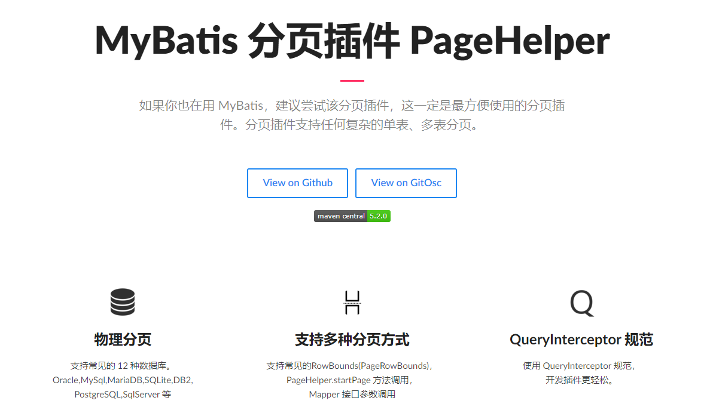
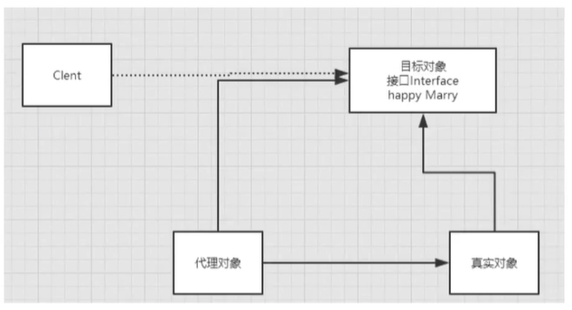
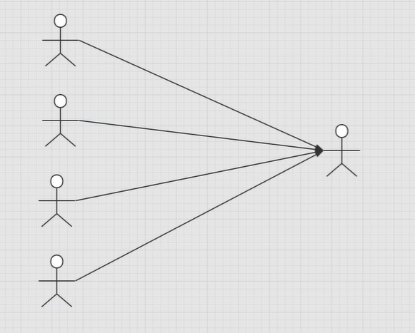
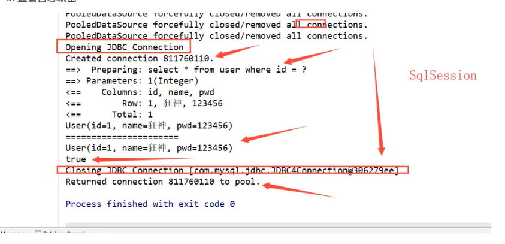
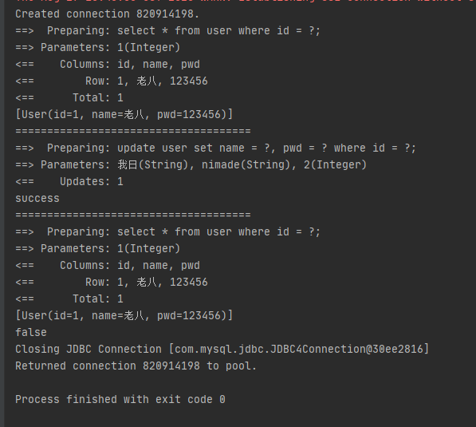
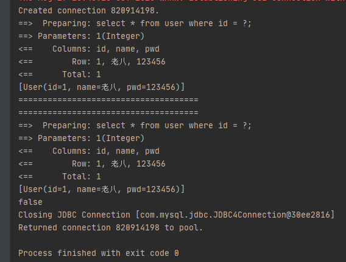
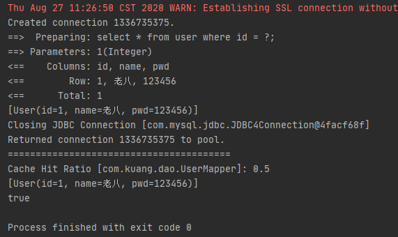
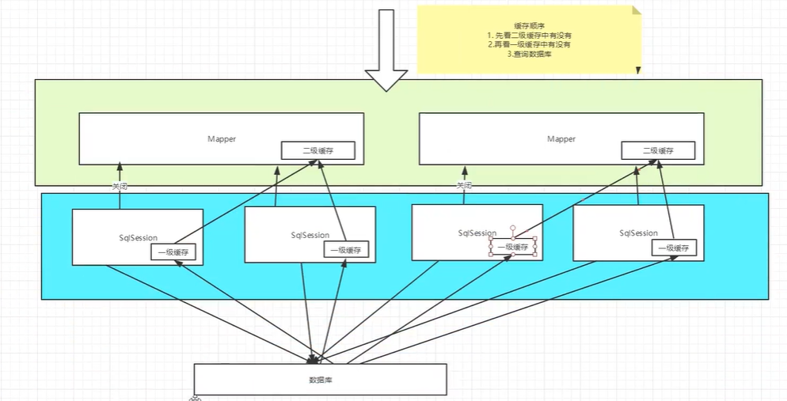

Mybatis

环境：

-   JDK1.8
-   Mysql5.7
-   maven3.6.1
-   IDEA

回顾

-   JDBC
-   Mysql
-   Java基础
-   Maven
-   Junit


SSM框架：配置文件的。 

最好的学习方式，学习官方文档

# 1.简介

## 1.1 什么是Mybatis

-   MyBatis 是一款优秀的**持久层框架**
-   它支持自定义 SQL、存储过程以及高级映射
-   MyBatis 免除了几乎所有的 JDBC 代码以及设置参数和获取结果集的工作。
-   MyBatis 可以通过简单的 XML 或注解来配置和映射原始类型、接口和 Java POJO（Plain Old Java Objects，普通老式 Java 对象）为数据库中的记录。
-   2013年11月迁移至Github


如何获得Mybatis？

-   Maven仓库

    ```xml
    <!-- https://mvnrepository.com/artifact/org.mybatis/mybatis -->
    <dependency>
        <groupId>org.mybatis</groupId>
        <artifactId>mybatis</artifactId>
        <version>3.5.2</version>
    </dependency>
    ```

-   Github：https://github.com/mybatis/mybatis-3

-   中文文档：https://mybatis.org/mybatis-3/zh/index.html


## 1.2 什么是持久化

数据持久化

-   持久化就是将程序的数据从持久状态和瞬时状态转化的过程
-   内存： **断电即失**
-   数据库（JDBC）， IO文件持久化
-   生活：冷藏、罐头


**为什么需要持久化？**

-   有一些对象，不能让他丢失
-   内存价格昂贵，硬盘便宜


## 1.3 持久化

Dao层、Service层，Controller层…

-   完成持久化工作的代码块
-   层与层之间的界限非常明显


## 1.4 为什么需要Mybatis？

-   帮助程序员将数据存入数据库。

-   方便
-   传统的JDBC代码过于复杂，所以出现了框架对原有的编码方式进行简化------》 自动化
-   不用Mybatis也可以，更容易上手。**技术没有高低之分**
-   优点：
    -   简单易学
    -   灵活
    -   sql和代码分离，提高可维护性
    -   提供映射标签，支持对象与数据库的orm字段关系映射
    -   提供对象关系映射标签，支持对象关系组建维护
    -   提供xml标签，支持编写动态sql


**最重要的一点：使用人数多，生态氛围良好**

Spring SpringMVC SpringBoot


# 2. 第一个Mybatis程序

思路： 搭建环境 --》 导入Mybatis --》 编写代码 ---》 测试！


## 2.1 搭建环境

搭建数据库

```sql
CREATE DATABASE `mybatis`;

USE `mybatis`;

CREATE TABLE `user`(
	`id` INT(20) PRIMARY KEY NOT NULL;
	`name` VARCHAR(30) DEFAULT NULL;
	`pwd` VARCHAR(30) DEFAULT NULL;
)ENGINE=INNODB DEFAULT CHARSET=utf8;

INSERT INTO `user` (`id`, `name`, `pwd`) VALUES
	(1, '老八', '123456'),
	(2, '张三', '123456'),
	(3, '李四', '123456'),
```


新建项目

1.  新建一个普通的maven项目

2.  删除src目录（将该文件作为父工程）

3.  导入maven依赖

    ```xml
    <dependencies>
    <!--    mysql驱动-->
        <dependency>
            <groupId>mysql</groupId>
            <artifactId>mysql-connector-java</artifactId>
            <version>5.1.47</version>
        </dependency>
    <!--    mybatis-->
        <dependency>
            <groupId>org.mybatis</groupId>
            <artifactId>mybatis</artifactId>
            <version>3.5.2</version>
        </dependency>
    <!--    junit-->
        <dependency>
            <groupId>junit</groupId>
            <artifactId>junit</artifactId>
            <version>4.12</version>
            <scope>test</scope>
        </dependency>
    </dependencies>
    ```


## 2.2 创建一个模块

-   编写mybatis的核心配置文件

    ```xml
    <?xml version="1.0" encoding="UTF-8" ?>
    <!DOCTYPE configuration
            PUBLIC "-//mybatis.org//DTD Config 3.0//EN"
            "http://mybatis.org/dtd/mybatis-3-config.dtd">
    <!--核心配置文件-->
    <configuration>
        <environments default="development">
    <!--    环境-->
            <environment id="development">
    <!--        事务管理-->
                <transactionManager type="JDBC"/>
                <dataSource type="POOLED">
                    <property name="driver" value="com.mysql.jdbc.Driver"/>
                    <property name="url" value="jdbc:mysql://localhost:3306/mybatis?userSSL=true&amp;useUnicode=true&amp;characterEncoding=UTF-8"/>
                    <property name="username" value="root"/>
                    <property name="password" value="123456"/>
                </dataSource>
            </environment>
        </environments>
        
    <!--    控制作用域，删掉作用与全局-->
    <!--    <mappers>-->
    <!--        <mapper resource="org/mybatis/example/BlogMapper.xml"/>-->
    <!--    </mappers>-->
    </configuration>
    ```

    

-   编写mybatis工具类

    ```java
    //sqlSessionFactory --> sqlSession
    public class MybatisUtils {
        private static SqlSessionFactory sqlSessionFactory;
        static{
            try {// 使用Mybatis第一步：获取sqlSessionFactory对象
                String resource = "mybatis-config.xml";
                InputStream inputStream = Resources.getResourceAsStream(resource);
                sqlSessionFactory = new SqlSessionFactoryBuilder().build(inputStream);
            } catch (IOException e) {
                e.printStackTrace();
            }
        }
    
        //既然有了 SqlSessionFactory，顾名思义，我们可以从中获得 SqlSession 的实例。SqlSession 提供了在数据库执行 SQL 命令所需的所有方法。
        // 你可以通过 SqlSession 实例来直接执行已映射的 SQL 语句
        public static SqlSession getSqlSession(){
            return sqlSessionFactory.openSession();
        }
    }
    ```


## 2.3 编写代码

-   实体类

    ```java
    public class User {
        private int id;
        private String name;
        private String pwd;
    
        public User(int id, String name, String pwd) {
            this.id = id;
            this.name = name;
            this.pwd = pwd;
        }
    
        public User() {
        }
    
        public int getId() {
            return id;
        }
    
        public void setId(int id) {
            this.id = id;
        }
    
        public String getName() {
            return name;
        }
    
        public void setName(String name) {
            this.name = name;
        }
    
        public String getPwd() {
            return pwd;
        }
    
        public void setPwd(String pwd) {
            this.pwd = pwd;
        }
    
        @Override
        public String toString() {
            return "User{" +
                    "id=" + id +
                    ", name='" + name + '\'' +
                    ", pwd='" + pwd + '\'' +
                    '}';
        }
    }
    ```

-   Dao接口

    ```java
    public interface UserDao {
        List<User> getUserList();
    }
    ```

-   接口实现类(由原来的UserDaoImpl文件转变为一个Mapper配置文件)

    ```xml
    <?xml version="1.0" encoding="UTF-8" ?>
    <!DOCTYPE mapper
            PUBLIC "-//mybatis.org//DTD Mapper 3.0//EN"
            "http://mybatis.org/dtd/mybatis-3-mapper.dtd">
    <!--nameSpace 绑定一个对应的Dao/Mapper接口-->
    <mapper namespace="com.kuang.dao.UserDao">
        <!--查询语句-->
        <select id="getUserList" resultType="com.kuang.pojo.User">
            select * from `user`
        </select>
    </mapper>
    ```

    


## 2.4 测试

**注意点：**

`org.apache.ibatis.binding.BindingException: Type interface com.kuang.dao.UserDao is not known to the MapperRegistry.`

```xml
<!--每一个Mapper.xml 都需要在Mybatis核心配置文件中注册-->
    <mappers>
        <mapper resource="com/kuang/dao/UserMapper.xml"/>
    </mappers>
```

**xml文件中不要有任何中文注释**

-   junit测试

    ```xml
        @Test
        public void test(){
            //第一步：获得SqlSession对象
            SqlSession sqlSession = MybatisUtils.getSqlSession();
            //方式一：执行SQL
            UserDao userDao = sqlSession.getMapper(UserDao.class);
            List<User> userList = userDao.getUserList();
            for (User user : userList) {
                System.out.println(user);
            }
    
            //关闭sqlSession
            sqlSession.close();
        }
    ```


可能会遇到的问题：

1.  配置文件没有注册
2.  绑定接口不对
3.  方法名不对
4.  返回类型不对
5.  Maven导出资源问题


# 3. CRUD

## 3.1 namespace

namespace中的包名要和Dao/Mapper接口的包名一致！

```xml
<mapper namespace="com.kuang.dao.UserDao">
   ....
</mapper>
```

## 3.2 select

选择，查询语句

```xml
<select id="getUserList" resultType="com.kuang.pojo.User">
	select * from `user`
</select>
```

-   id: 就是对应的namespace中的方法名；
-   resultType： sql语句执行的返回值！
-   parameterType：参数类型


1.  编写接口

    ```java
    //插入一个用户
    int addUser(User user);
    ```

2.  编写对应的mapper中的sql语句

    ```xml
    <select id="getUserById" resultType="com.kuang.pojo.User" parameterType="int">
        select * from `user` where id = #{id}
    </select>
    ```

3.  测试

    ```java
    @Test
    public void getUserById(){
        SqlSession sqlSession = MybatisUtils.getSqlSession();
    
        UserDao mapper = sqlSession.getMapper(UserDao.class);
        User userById = mapper.getUserById(1);
        System.out.println(userById);
    }
    ```

## 3.3 Insert

```xml
<insert id="addUser" parameterType="com.kuang.pojo.User">
    insert into `user` (`id`, `name`, `pwd`) value (#{id}, #{name}, #{pwd})
</insert>
```

## 3.4 Update

```xml
<update id="updateUser" parameterType="com.kuang.pojo.User">
    update mybatis.user set name = #{name}, pwd = #{pwd} where id = #{id}
</update>
```

## 3.5 Delete

```xml
<delete id="deleteUser" parameterType="int">
    delete from `user` where id=#{id}
</delete>
```


## 3.6 分析错误

-   写sql语句的xml文件中 不同的sql操作标签不要搞错（select标签中写insert！）
-   resources绑定 mapper，需要使用路径！ /分割，不是包名！
-   程序配置文件必须符合规范
-   NullPointerException错误，变量作用域问题。作用域要符合实际情况
-   输出的xml文件存在乱码问题，导致无法运行
-   Maven资源没有导出


## 3.7 万能Mapper

假设，实体类或者数据库的表、字段或者参数数量过多，我们可以考虑使用Map

```java
// 万能Map
int addUser1(Map<String, Object> map);
```

```xml
<insert id="addUser" parameterType="map">
    insert into `user` (`id`, `name`, `pwd`) value (#{userid}, #{userName}, #{passWord})
</insert>
```


Map传递参数，直接在sql中取出key即可

对象传递参数，直接在sql中取对象的属性即可！

只有一个基本类型参数的情况下，可以直接在sql中取到

多个参数用Map，或者**使用注解**！


## 思考

模糊查询？

1.  Java代码执行的时候传递通配符%%

    ```java
    List<User> userLike = mapper.getUserLike("%四%");
    ```

2.  在sql拼接中使用通配符！

    ```sql
    select * from `user` where name like "%"#{value}"%"
    ```


# 4. 配置解析

## 4.1 核心配置文件

-   mybatis-config.xml

-   Mybatis的配置文件包含了会深深影响MyBatis行为的设置和属性信息

    ```xml
    configuration（配置）
    properties（属性）
    settings（设置）
    typeAliases（类型别名）
    typeHandlers（类型处理器）
    objectFactory（对象工厂）
    plugins（插件）
    environments（环境配置）
    environment（环境变量）
    transactionManager（事务管理器）
    dataSource（数据源）
    databaseIdProvider（数据库厂商标识）
    mappers（映射器）
    ```


## 4.2 环境配置（Environment）

MyBatis 可以配置成适应多种环境

**不过要记住：尽管可以配置多个环境，但每个 SqlSessionFactory 实例只能选择一种环境。**

学会配置和切换运行环境，就是选择id

MyBatis默认的事务管理器就是JDBC， 连接池：POOLED！


## 4.3 属性（properties）

我们可以通过properties属性来实现引用配置文件

这些属性可以在外部进行配置，并可以进行动态替换。你既可以在典型的 Java 属性文件中配置这些属性，也可以在 properties 元素的子元素中设置。【db.properties】


编写一个配置文件

```properties
driver=com.mysql.jdbc.Driver
url=jdbc:mysql://localhost:3306/mybatis?userSSL=true&useUnicode=true&characterEncoding=UTF-8
username=root;
password=123456
```


在核心配置文件中引入

```xml
<!--这玩意在配置文件中 有 顺序要求。。-->
<properties resource="org/mybatis/example/config.properties">
  <property name="username" value="dev_user"/>
  <property name="password" value="F2Fa3!33TYyg"/>
</properties>
```

-   可以直接引入外部文件
-   可以在其中增加一些属性配置
-   如果内外配置有同一个字段，优先使用外部配置文件的


## 4.4 类别别名（typeAliases）

-   类型别名可为 Java 类型设置一个缩写名字
-   它仅用于 XML 配置，意在降低冗余的全限定类名书写

```xml
<typeAliases>
    <typeAlias type="com.kuang.pojo.User" alias="User" />
</typeAliases>
```

也可以指定一个包名， MyBatis会在包名下面搜索需要的Java Bean， 比如：

扫描实体类的包。它的默认别名就是这个类的类名，

```XML
<typeAliases>
    <package name="com.kuang.pojo"/>
</typeAliases>
```

如果实体类比较少的话，使用第一种方式。

如果实体类很多的话，使用第二种方式。

第一种方式可以自己定义别名，但是第二种不可以，不过可以通过注解@Alias来定义每个类读取的别名

```java
@Alias("author")
public class Author {
    ...
}
```


## 4.5 设置（settings）

这是MyBatis中极为重要的调整设置，他们会改变MyBatis的运行时行为


## 4.6 其他配置

-   [typeHandlers（类型处理器）](https://mybatis.org/mybatis-3/zh/configuration.html#typeHandlers)
-   [objectFactory（对象工厂）](https://mybatis.org/mybatis-3/zh/configuration.html#objectFactory)
-   [plugins（插件）](https://mybatis.org/mybatis-3/zh/configuration.html#plugins)
    -   mybatis-generator-core
    -   mybatis-plus
    -   通用mapper


## 4.7 映射器（mappers）

MapperRegistry：注册绑定我们的Mapper文件

方式一：使用相对于类路径的资源引用

```xml
<mappers>
    <mapper resource="com/kuang/dao/UserMapper.xml"/>
</mappers>
```

方式二：使用class文件绑定注册（使用mapper接口实现类的完全限定类名）

```xml
<mappers>
  <mapper class="com.kuang.dao.UserMapper"/>
</mappers>
```

注意点：

-   接口文件和Mapper配置文件必须同名
-   接口文件和Mapper配置文件必须在同一个包下


方式三： 将包内的映射器接口全部注册为映射器

```xml
<mappers>
  <package name="com.kuang.dao"/>
</mappers>
```

-   接口文件和Mapper配置文件必须同名
-   接口文件和Mapper配置文件必须在同一个包下


## 4.8 生命周期和作用域


不同作用域和生命周期类别是至关重要的，因为错误的使用会导致非常严重的**并发问题**。

**SqlSessionFactoryBuilder：**

-   一旦创建了SqlSessionFactory，就不再需要他了
-   局部变量


**SqlSessionFactory:**

-   说白了就是可以想象为：数据库连接池
-   SqlSessionFactory 一旦被创建就应该在应用的运行期间一直存在，没有任何理由丢弃它或重新创建另一个实例。
-   SqlSessionFactory 的最佳作用域是应用作用域
-   最简单的就是使用单例模式或者静态单例模式


**SqlSession：**

-   连接到连接池的一个请求！
-   用完之后需要尽快关闭， 否则资源被占用。


这里面的每一个Mapper，就代表一个具体的业务。


# 5. 解决属性名和字段名不一致的问题

## 5.1 问题

```java
class User{
    private int id;
    private String name;
    private String password;
}
```

实体类

```sql
select * from user where id = #{id};
```

查询结果 password字段为空


解决方法：

-   给查询字段取别名

    ```xml
    select id, name,  pwd as password from user where id = #{id}
    ```


## 5.2 resultMap

结果集映射

```
id name pwd
id name password
```


```xml
<resultMap id="UserMap" type="User">
    <result  column="id" property="id"/>
    <result column="name" property="name"/>
    <result column="pwd" property="password"/>
</resultMap>

<select id="getUserList" resultMap="UserMap">
    select * from `user`
</select>
```


-   `resultMap`元素是Mybatis中最重要最强大的元素
-   ResultMap的设计思想是，对于简单的语句根本不需要配置显示的结果映射，而对于复杂一点的语句只需要描述他们的关系即可。
-   这就是 `ResultMap` 的优秀之处——你完全可以不用显式地配置它们（只需要配置不同的列即可）


# 6. 日志

## 6.1 日志工厂

如果数据库操作出现了异常，我们需要排错，日志就是最好的助手

曾经：sout， debug

现在：日志工厂


-   SLF4J
-   **LOG4J**
-   LOG4J2
-   JDK_LOGGING
-   COMMONS_LOGGING
-   **STDOUT_LOGGING**
-   NO_LOGGING


在Mybatis中具体使用哪一个日志实现，在设置中设定

STDOUT_LOGGING 标准日志输出

在mybatis核心配置文件中，进行配置

```xml
<settings>
	<setting name="logImpl" value="STDOUT_LOGGING"/>
</settings>
```


## 6.2 Log4j

什么是Log4j？

-   Log4j是[Apache](https://baike.baidu.com/item/Apache/8512995)的一个开源项目，通过使用Log4j，我们可以控制日志信息输送的目的地是[控制台](https://baike.baidu.com/item/控制台/2438626)、文件、[GUI](https://baike.baidu.com/item/GUI)组件
-   我们也可以控制每一条日志的输出格式
-   通过定义每一条日志信息的级别，我们能够更加细致地控制日志的生成过程
-   通过一个[配置文件](https://baike.baidu.com/item/配置文件/286550)来灵活地进行配置，而不需要修改应用的代码

1.  使用外部类需要先导入log4j的jar包

    ```xml
    <!-- https://mvnrepository.com/artifact/log4j/log4j -->
    <dependency>
        <groupId>log4j</groupId>
        <artifactId>log4j</artifactId>
        <version>1.2.17</version>
    </dependency>
    ```

2.  log4j.properties

    ```properties
    #将等级为DEBUG的日志信息输出到console和file这两个目的地，console和file的定义在下面的代码
    log4j.rootLogger=DEBUG,console,file
    
    #控制台输出的相关设置
    log4j.appender.console = org.apache.log4j.ConsoleAppender
    log4j.appender.console.Target = System.out
    log4j.appender.console.Threshold=DEBUG
    log4j.appender.console.layout = org.apache.log4j.PatternLayout
    log4j.appender.console.layout.ConversionPattern=[%c]-%m%n
    
    #文件输出的相关设置
    log4j.appender.file = org.apache.log4j.RollingFileAppender
    log4j.appender.file.File=./log/kuang.log
    log4j.appender.file.MaxFileSize=10mb
    log4j.appender.file.Threshold=DEBUG
    log4j.appender.file.layout=org.apache.log4j.PatternLayout
    log4j.appender.file.layout.ConversionPattern=[%p][%d{yy-MM-dd}][%c]%m%n
    
    #日志输出级别
    log4j.logger.org.mybatis=DEBUG
    log4j.logger.java.sql=DEBUG
    log4j.logger.java.sql.Statement=DEBUG
    log4j.logger.java.sql.ResultSet=DEBUG
    log4j.logger.java.sql.PreparedStatement=DEBUG
    ```

3.  配置log4j为日志的实现

    ```xml
    <settings>
    	<setting name="logImpl" value="LOG4J"/>
    </settings>
    ```

4.  Log4j的使用，直接test

    


**简单使用**

1.  在要使用Log4j的类中，导入包`import org.apache.log4j.Logger;`

2.  日志对象，参数为当前类的class

    ```java
    static Logger logger = Logger.getLogger(UserDaoTest.class);
    ```

3.  日志级别

    ```java
    logger.info("info:进入了testLog4j方法");
    logger.debug("debug:进入了debug模式");
    logger.error("error:进入hhh");
    ```

    


# 7. 分页

**分页的意义：**

-   减少数据的处理量，提高查询速度


## 7.1 LImit分页

```sql
-- select * from user limit startIndex, pageSize;
select * from user limit 3;  -- [0, n]
```


**使用Mybatis实现分页， 核心SQL**

1.  接口

    ```
    List<User> getUserByLimit(Map<String, Integer> map);
    ```

2.  Mapper.xml

    ```xml
    <select id="getUserByLimit" parameterType="map" resultType="user">
        select * from `user` limit #{startIndex}, #{pageSize}
    </selet>
    ```

3.  测试

    ```java
    @Test
    public void getUserByLimit(){
        SqlSession sqlSession = MybatisUtils.getSqlSession();
        UserDao mapper = sqlSession.getMapper(UserDao.class);
        Map<String, Integer> map = new HashMap<String, Integer>();
        map.put("startIndex", 0);
        map.put("pageSize", 5);
        List<User> userByLimit = mapper.getUserByLimit(map);
        for (User user : userByLimit) {
            System.out.println(user);
        }
    
        sqlSession.close();
    }
    ```


## 7.2 RowBounds分页（了解）

不使用Sql实现，使用对象方式实现

1.  接口

    ```java
    List<User> getUserByRowBounds();
    ```

2.  Mapper.xml

    ```xml
    <select id="getUserByRowBounds" resultType="user">
        select * from `user`
    </select>
    ```

3.  测试

    ```java
    @Test
    public void getUserByRowBounds(){
        SqlSession sqlSession = MybatisUtils.getSqlSession();
    
        // RowBounds
        RowBounds rowBounds = new RowBounds(1, 2);
        
        // Java代码层面实现分页
        List<User> userList = sqlSession.selectList("com.kuang.dao.UserDao.getUserByRowBounds", null, rowBounds);
        for (User user : userList) {
            System.out.println(user);
        }
    }
    ```


## 7.3 分页插件



了解即可，


# 8. 使用注解开发

## 8.1 面向接口开发

-   大家之前都学习过面向对象编程，也学习过接口，但是真正的开发中，我们大部分时间都会选择面向接口编程
-   **根本原因：==解耦==，可拓展，提高服用，分层开发中，上层不用管具体的实现，大家都遵循共同的标准，使得开发变得更容易，规范性更好**
-   在一个面向对象的系统中，系统的各种功能都是由许许多多的不同对象协作完成的。在这种情况下，各个对象内部是如何实现自己的，对系统设计人员来讲就不是那么重要了；
-   而各个对象之间的协作关系则成为了系统设计的关键。小到不同类之间的通信，大到各个模块之间的交互，在系统设计之初都是要着重考虑的，这也是系统设计的主要工作内容。而面向接口编程就是按照这种思想来编程的。


**关于接口的理解**

-   接口从更深层次的理解，应是定义（规范，约束）与实现（名实分离的原则）的分离。
-   接口本身反映了系统设计人员对系统的抽象理解
-   接口应有两类：
    -   第一类是对一个个体的抽象，它可对应为一个抽象体（abstract class）
    -   第二类是对一类个体某一方面的抽象，即形成一个抽象面（interface）
-   一个个体可能有很多个抽象面。抽象体与抽象面是有区别的。


**三个面向的区别**

-   面向对象是指， 我们考虑问题时，以对象为单位，考虑它的属性及方法
-   面向过程是指，我们考虑问题时，以一个具体的流程（事务过程）为单位，考虑它的实现
-   接口设计与非接口设计是针对复用技术而言的，与面向对象（过程）不是一个问题，更多的体现就是对系统整体的架构。


## 8.2 使用注解开发

1.  注解在接口上实现

    ```java
    @Select("select * from user")
    List<User> getUsers();
    ```

2.  需要在核心配置文件中绑定接口！

    ```xml
    <!--绑定接口-->
    <mappers>
        <mapper class="com.kuang.dao.UserDao"/>
    </mappers>
    ```

3.  测试（和使用xml没有太大区别）

    ```java
    @Test
    public void test(){
        SqlSession sqlSession = MybatisUtils.getSqlSession();
    
        // 底层主要应用反射
    
        UserDao userDao = sqlSession.getMapper(UserDao.class);
        List<User> userList = userDao.getUsers();
    
        for (User user : userList) {
            System.out.println(user);
        }
        //关闭sqlSession
        sqlSession.close();
    }
    ```


本质： 使用反射机制实现

底层：动态代理




**Mybatis详细的执行流程！**


## 8.3 CRUD

我们可以在工具类创建的时候，可以自动提交事务

```java
public static SqlSession getSqlSession(){
    return sqlSessionFactory.openSession(true);
}
```


编写接口，添加注解

```java
// 方法存在多个参数， 必须给每个参数添加@Param注解
@Select("select * from user where id = #{id}")
User getUserById(@Param("id") int id);

@Insert("insert into user(id, name, pwd) values (#{id}, #{name}, #{pwd})")
int addUser(User user);

@Update("update user set name=#{name}, pwd=#{pwd} where id = #{id}")
int updateUser(User user);

@Delete("delete from user where id = #{uid}")
int deleteUser(@Param("uid") int id);
```


测试类

【注意：我们必须要将接口注册绑定到我们的核心配置文件中】


**关于@Param()注解**

-   基本类型的参数或者String类型，需要加上
-   引用类型不需要加
-   如果只有一个基本类型的话，可以忽略，但是建议都加上
-   我们在SQL中引用的就是我们这里@Param()中设定的属性名

**${} 不能防止SQL注入, #{}是预编译sql，可以防止SQL注入，能用#{}就用#{}**


# 9. Lombok

使用步骤：

1.  在IDEA中安装Lombok插件！

2.  在项目中导入lombok的jar包

    ```xml
    <!-- https://mvnrepository.com/artifact/org.projectlombok/lombok -->
    <dependency>
        <groupId>org.projectlombok</groupId>
        <artifactId>lombok</artifactId>
        <version>1.18.12</version>
        <scope>provided</scope>
    </dependency>
    ```

3.  在实体类上加注解即可


```java
@Getter and @Setter
@FieldNameConstants
@ToString
@EqualsAndHashCode
@AllArgsConstructor, @RequiredArgsConstructor and @NoArgsConstructor
@Log, @Log4j, @Log4j2, @Slf4j, @XSlf4j, @CommonsLog, @JBossLog, @Flogger, @CustomLog
@Data
@Builder
@SuperBuilder
@Singular
@Delegate
@Value
@Accessors
@Wither
@With
@SneakyThrows
@val
@var
experimental @var
@UtilityClass
Lombok config system
```


说明:

```java
@Date: 无参构造，get，set， toString，hashCode， equals
@AllArgsConstructor： 有参构造
@NoArgsConstructor： 无参构造
```


# 10. 多对一

多对一：



-   多个学生， 对应一个老师
-   对于学生这边， **关联**  ---- 多个学生关联一个老师【多对一】
-   对于老师而言，**集合** ----- 一个老师下面有多个学生【一对多】


数据准备

```sql
CREATE TABLE `teacher` (
`id` INT(10) NOT NULL,
`name` VARCHAR(30) DEFAULT NULL,
PRIMARY KEY (`id`)
) ENGINE=INNODB DEFAULT CHARSET=utf8

INSERT INTO teacher(`id`, `name`) VALUES (1, '秦老师');

CREATE TABLE `student` (
`id` INT(10) NOT NULL,
`name` VARCHAR(30) DEFAULT NULL,
`tid` INT(10) DEFAULT NULL,
PRIMARY KEY (`id`),
KEY `fktid` (`tid`),
CONSTRAINT `fktid` FOREIGN KEY (`tid`) REFERENCES `teacher` (`id`)
) ENGINE=INNODB DEFAULT CHARSET=utf8;
`student`
```


## 测试环境搭建

1.  导入lombok
2.  新建实体类 Teacher， Student
3.  建立Mapper接口
4.  建立Mapper.xml文件
5.  在核心配置文件中绑定注册我们的mapper接口或者文件【方式很多，随意选择】
6.  测试查询是否成功


## 按照查询嵌套处理

```xml
<select id="getStudentList" resultMap="StudentTeacher">
    select * from student;
</select>
<resultMap id="StudentTeacher" type="Student">
    <result property="id" column="id"/>
    <result property="name" column="name" />
<!--        对于复杂的属性，我们需要单独处理 对象： association 集合：collection-->
   	<association property="teacher" column="tid" javaType="Teacher" select="getTeacher" />
</resultMap>

<select id="getTeacher" resultType="Teacher">
	select * from teacher where id = #{id}
</select>
```


## 按照结果嵌套查询

```xml
<!--按照结果嵌套处理-->
<select id="getStudentList2" resultMap="StudentTeacher2">
    select s.id sid, s.name sname, t.name tname
    from student s, teacher t
    where s.tid = t.id;
</select>

<resultMap id="StudentTeacher2" type="Student">
    <result property="id" column="sid"/>
    <result property="name" column="sname" />
    <association property="teacher" javaType="Teacher">
        <result property="name" column="tname" />
    </association>
</resultMap>
```


回顾Mysql多对一查询方式：

-   子查询 
-   连表查询


# 11. 一对多

比如： 一个老师拥有多个学生

对于老师而言，就是一对多的关系


## 环境搭建

**实体类**

```java
@Data
public class Teacher {
    private int id;
    private String name;

    private List<Student> studentList;
}
```

```java
@Data
public class Student {
    private int id;
    private String name;
    private int tid;
}
```


## 按照结果嵌套处理

```xml
<select id="getTeacher" resultMap="TeacherStudent">
    select s.id sid, s.name sname, t.name tname, t.id tid
    from student s, teacher t
    where s.tid = t.id and t.id = #{tid}
</select>
<resultMap id="TeacherStudent" type="Teacher">
    <result property="id" column="tid" />
    <result property="name" column="tname" />
    <!--
    javaType ="" 指定属性的类型
    集合中的泛型信息，我们使用ofType获取
    -->
    <collection property="studentList" ofType="Student">
        <result property="id" column="sid" />
        <result property="name" column="sname" />
        <result property="tid" column="tid" />
    </collection>
</resultMap>
```

## 按照查询嵌套处理

```xml
<select id="getTeacher2" resultMap="TeacherStudent2">
    select * from teacher where id = #{tid}
</select>
<resultMap id="TeacherStudent2" type="Teacher">
    <collection property="studentList" javaType="ArrayList" ofType="Student" select="getStudentByTeacherId" column="id" />
</resultMap>

<select id="getStudentByTeacherId" resultType="Student">
    select * from student where tid = #{tid}
</select>
```


## 小结

1.  关联---association 【多对一】
2.  集合 --- collection 【一对多】
3.  javaType && ofType
    1.  javaType 用来指定实体类中属性的类型
    2.  ofType 用来指定映射到List或者集合中的pojo类型，泛型中的约束类型


**注意点：**

-   保证SQL的可读性，尽量通俗易懂
    -   按照结果嵌套处理 映射简单 sql复杂
    -   按照查询嵌套处理 sql简单 映射复杂
-   注意一对多和多对一中，属性名字和字段的问题
-   如果问题不好排查错误，可以使用日志，建议使用log4j


面试高频

-   mysql引擎
-   InnoDB 底层原理
-   索引
-   索引优化
-   游标
-   存储过程


# 12. 动态SQL

什么是动态SQL：动态SQL就是指根据不同的条件生成不同的SQL语句。

```xml
if
choose (when, otherwise)
trim (where, set)
foreach
```


## 搭建环境

```sql
CREATE TABLE `blog`(
`id` VARCHAR(50) NOT NULL COMMENT '博客id',
`title` VARCHAR(100) NOT NULL COMMENT '博客标题',
`author` VARCHAR(30) NOT NULL COMMENT '博客作者',
`create_time` DATETIME NOT NULL COMMENT '创建时间',
`views` INT(30) NOT NULL COMMENT '浏览量'
)ENGINE=INNODB DEFAULT CHARSET=utf8
```


创建一个基础工程

1.  导包

2.  编写配置文件

3.  编写实体类

    ```java
    @Data
    public class Blog {
        private int id;
        private String title;
        private String author;
        private Date createTime;
        private int views;
    }
    ```

4.  编写实体类对应的Mapper接口和Mapper.xml文件


## if

```xml
<select id="queryBlogIf" parameterType="map" resultType="blog">
    select * from blog where 1=1
    <if test="title!=null">
        and title = #{title}
    </if>
    <if test="author != null">
        and author = #{author}
    </if>
</select>
```


## choose (when, otherwise)

```xml
<select id="queryBlogChoose" parameterType="map" resultType="blog">
    select * from blog
    <where>
        <choose>
            <when test="title != null">
                title = #{title}
            </when>
            <when test="author != null">
                author = #{author}
            </when>
            <otherwise>
                and views = #{views}
            </otherwise>
        </choose>
    </where>
</select>
```


## trim（where，set）
```xml
<select id="queryBlogIf" parameterType="map" resultType="blog">
    select * from blog
    <where>
        <if test="title!=null">
        	and title = #{title}
    	</if>
    	<if test="author != null">
        	and author = #{author}
	    </if>
    </where>
</select>
```


```xml
<update id="updateBlog" parameterType="map">
    update blog
    <set>
        <if test="title != null">
            title = #{title},
        </if>
        <if test="author != null">
            author = #{author}
        </if>
    </set>
    where id = #{id}
</update>
```


==**所谓动态SQL，本质都是SQL，只是我们可以在SQL层面，去执行逻辑代码**==


## SQL片段

有的时候，我们可能会将一些功能部分抽取出来，重复使用

1.  使用SQL标签抽取公共的部分，提供id

    ```xml
    <sql id="wuhu">
        <if test="title!=null">
            title = #{title},
        </if>
        <if test="author != null">
            author = #{author},
        </if>
    </sql>
    ```

2.  在需要使用的地方，使用include + id即可完成引用

    ```xml
    <update id="updateBlog" parameterType="map">
        update blog
        <set>
            <include refid="wuhu"></include>
        </set>
        where id = #{id}
    </update>
    ```

3.   注意事项

    -   最好基于单表来定义SQL片段
    -   不要存在where标签


## foreach

```xml
<select id="queryBlogForeach" parameterType="map" resultType="blog">
    select * from blog
    <where>
        id in
        <foreach collection="list" index="index" item="item" open="(" close=")" separator=", ">
            #{item}
        </foreach>
    </where>
</select>
```


==动态SQL就是在拼接SQL语句，我们只要保证SQL的正确性，按照SQL的格式，去排列组合就可以了==

建议：

- 现在Mysql中写出完整的SQL,再对应的去修改成为我们的动态SQL实现通用即可！


# 13. 缓存

## 13.1 简介

查询 需要连接数据库，如果多次需要一个数据，就会多次读取数据库，非常消耗资源

我们可以将一次查询的结果，给他暂存在一个可以直接取到的地方 ----》 内存：缓存


我们再次使用相同的数据的时候，就可以直接走缓存，而不需要走数据库了


1.  什么是缓存【Cache】？
    -   存在内存中的临时数据。
    -   将用户经常查询的数据放在缓存（内存）种，用户去查询数据就不用从磁盘上（关系型数据库数据文件）查询，可以直接用缓存中查询，提高查询效率，解决高并发系统的性能问题
2.  为什么使用缓存？
    -   因为能减少和数据库交互的次数，减少系统开销，提高系统性能
3.  什么样的数据适合使用缓存？
    -   经常查询且不经常发生改变的数据


## 13.2 Mybatis缓存

-   MyBatis包含一个非常强大的查询缓存特性，它可以非常方便地定制和配置缓存。缓存可以极大地提升查询效率。
-   MyBatis系统中默认了两级缓存：一级缓存和二级缓存
    -   默认情况下，只有一级缓存开启。（SqlSession级别的缓存，也成为本地缓存） --> 作用域较低
    -   二级缓存需要手动开启和配置，它是基于namespace级别的缓存。 --> 作用域较高
    -   为了提高扩展性，MyBatis定义了缓存接口Cache。我们可以通过实现Cache接口来自定义二级缓存


## 13.3 一级缓存

-   一级缓存也叫本地缓存：SqlSession
    -   与数据库同一次会话期间查询到的数据会放在本地缓存中。
    -   以后如果需要获取相同的数据，直接从缓存中拿，不用再去拆线呢数据库；


测试步骤：

1.  开启日志！

2.  测试在一个Session中查询两次相同记录

    ```java
    @Test
    public void test(){
        SqlSession sqlSession = MybatisUtils.getSqlSession();
        UserMapper mapper = sqlSession.getMapper(UserMapper.class);
        List<User> users = mapper.queryUsersById(1);
        System.out.println(users);
    
        System.out.println("=====================================");
    
        List<User> user1 = mapper.queryUsersById(1);
        System.out.println(user1);
    
        System.out.println(user1 == users);
    
        sqlSession.close();
    }
    ```

3.  查看日志输出




缓存失效的情况：

1.  查询不同的东西（压根就没有缓存）

2.  映射语句文件中的所有 insert、update 和 delete 语句会刷新缓存（增删改操作可能会修改原有数据）
	```java
@Test
public void test(){
    SqlSession sqlSession = MybatisUtils.getSqlSession();
    UserMapper mapper = sqlSession.getMapper(UserMapper.class);
    List<User> users = mapper.queryUsersById(1);
    System.out.println(users);
    System.out.println("=====================================");

    int woc = mapper.updateUser(new User(2, "我日", "nimade"));
    if (woc > 0) System.out.println("success");
    else System.out.println("failed");

    System.out.println("=====================================");

    List<User> user1 = mapper.queryUsersById(1);
    System.out.println(user1);

    System.out.println(user1 == users);

    sqlSession.close();
}
	```
	
	
	
3.  查询不同的Mapper.xml （二级缓存都不存在，更不用说一级缓存了）

4.  手动清除Cache

    ```java
    @Test
    public void test(){
        SqlSession sqlSession = MybatisUtils.getSqlSession();
        UserMapper mapper = sqlSession.getMapper(UserMapper.class);
        List<User> users = mapper.queryUsersById(1);
        System.out.println(users);
        System.out.println("=====================================");
    
        sqlSession.clearCache(); // 手动清除缓存
    
        System.out.println("=====================================");
    
        List<User> user1 = mapper.queryUsersById(1);
        System.out.println(user1);
    
        System.out.println(user1 == users);
    
        sqlSession.close();
    }
    ```

    


小结： 一级换粗你默认开启，只是在一次SqlSession中有效，也就是从连接到关闭的这个时间段

一级缓存就是一个Map。


## 13.4 二级缓存

-   二级缓存也叫全局缓存，一级缓存作用域太低，所以诞生了二级缓存
-   基于namespace级别的缓存，一个名称空间，对应一个二级缓存
-   工作机制
    -   一个会话查询一条数据，这个数据就会被放在当前会话的一级缓存中；
    -   如果当前会话关闭了，这个会话对应的一级缓存就没了；但我们想要的是，会话关闭了，一级缓存中的数据被保存在二级缓存中；
    -   新的会话查询信息，就可以从二级缓存中获内容；
    -   不同的mapper查处的数据会放在自己对应的缓存中（mapper）；


步骤：

1.  开启全局缓存

    ```xml
    <!--显式开启全局缓存-->
    <setting name="cacheEnabled" value="true"/>
    ```

2.  在要使用二级缓存的Mapper.xml中开启

    ```xml
    <!--    在当前的Mapper.xml中使用二级缓存-->
    <cache/>
    ```

    也可以自定义配置一些参数

    ```XML
    <!--    在当前的Mapper.xml中使用二级缓存-->
    <cache
    	eviction="FIFO"
       	flushInterval="60000"
        size="512"
        readOnly="true"/>
    ```

3.  测试

    ```java
    @Test
    public void test(){
        SqlSession sqlSession = MybatisUtils.getSqlSession();
        UserMapper mapper = sqlSession.getMapper(UserMapper.class);
        SqlSession sqlSession2 = MybatisUtils.getSqlSession();
        UserMapper mapper1 = sqlSession2.getMapper(UserMapper.class);
    
        List<User> users = mapper.queryUsersById(1);
        System.out.println(users);
        
        sqlSession.close();
        System.out.println("========================================");
    
        List<User> users1 = mapper1.queryUsersById(1);
        System.out.println(users1);
        System.out.println(users == users1);
    
        sqlSession2.close();
    }
    ```

    

    1.  问题：我们需要将实体类序列化

        可能会存在没有序列化的错误


小结：

-   只要开启了二级缓存，只要在一个Mapper下就有效
-   所有的数据都会先放在一级缓存中；
-   只有当会话提交，或者关闭的时候，才会提交到二级缓存中！


## 13.5 缓存




## 13.6 自定义缓存 - ehcache

`Echcache是一种广泛使用的开源Java分布式缓存。 主要面向通用缓存`


在程序中使用ehcache，先导包
```xml
<!-- https://mvnrepository.com/artifact/org.mybatis.caches/mybatis-ehcache -->
<dependency>
    <groupId>org.mybatis.caches</groupId>
    <artifactId>mybatis-ehcache</artifactId>
    <version>1.1.0</version>
</dependency>
```

在Mapper种指定我们使用的ehcache缓存实现

```xml
<cache type="org.mybatis.caches.ehcache.EhcacheCache"/>
```


然后加一个ehcache.xml

```xml
<?xml version="1.0" encoding="UTF-8"?>
<ehcache xmlns:xsi="http://www.w3.org/2001/XMLSchema-instance"
         xsi:noNamespaceSchemaLocation="http://ehcache.org/ehcache.xsd"
         updateCheck="false">

    <diskStore path="./tmpdir/Tmp_EhCache"/>

    <defaultCache
            eternal="false"
            maxElementsInMemory="10000"
            overflowToDisk="false"
            diskPersistent="false"
            timeToIdleSeconds="1800"
            timeToLiveSeconds="259200"
            memoryStoreEvictionPolicy="LRU"/>

    <cache
            name="cloud_user"
            eternal="false"
            maxElementsInMemory="5000"
            overflowToDisk="false"
            diskPersistent="false"
            timeToIdleSeconds="1800"
            timeToLiveSeconds="1800"
            memoryStoreEvictionPolicy="LRU"/>
</ehcache>
```


Redis来做缓存！ K-V