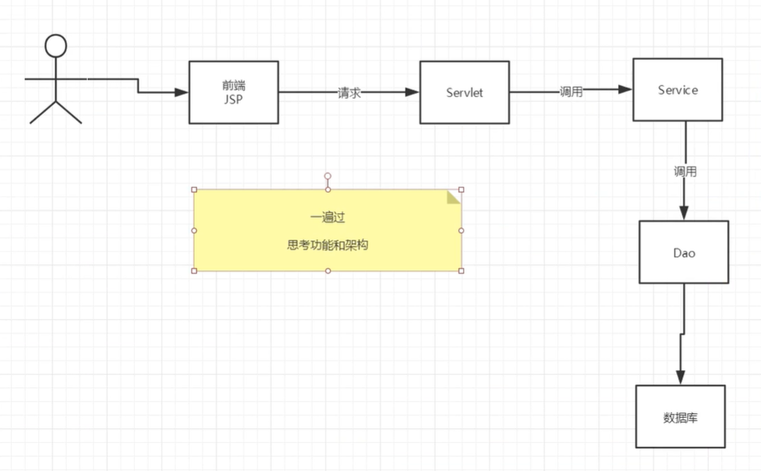

# 项目搭建

1. 搭建一个maven web项目

2. 配置tomcat

3. 测试项目能否运行

4. 导入项目中会遇到的jar包

    1. jsp
    2. Servlet
    3. mysql驱动
    4. jstl
    5. stand

5. 创建项目包结构

6. 编写实体类

    ORM映射：表---实体类

7. 编写基础公共类

    1. 数据库配置文件

        ```java
        driver=com.mysql.jdbc.Driver
        url=jdbc:mysql://localhost:3306/smbms?useUnicode=true&characterEncoding=utf-8
        username=root
        password=123456
        ```

        

    2. 编写数据库公共类

        ```java
        package com.aira.dao;
        
        import java.io.InputStream;
        import java.sql.*;
        import java.util.Properties;
        
        //操作数据库的公共类
        public class BaseDao {
            private static String driver;
            private static String url;
            private static String username;
            private static String password;
        
            //静态代码块，类加载的时候就被初始化了
            static {
                Properties properties = new Properties();
                //通过类加载器读取对应的资源
                InputStream is = BaseDao.class.getClassLoader().getResourceAsStream("db.properties");
        
                try{
                    properties.load(is);
                } catch (Exception e) {
                    e.printStackTrace();
                }
        
                driver = properties.getProperty("driver");
                url = properties.getProperty("url");
                username = properties.getProperty("username");
                password = properties.getProperty("password");
            }
        
            //获取数据库的连接
            public static Connection getConnection(){
                Connection connection = null;
                try {
                    Class.forName(driver);
                    connection = DriverManager.getConnection(url, username, password);
                } catch (Exception e) {
                    e.printStackTrace();
                }
                return connection;
            }
        
            //编写查询公共类
            public static ResultSet execute(Connection connection, String sql, Object[] params, ResultSet resultSet, PreparedStatement preparedStatement) throws SQLException {
                preparedStatement = connection.prepareStatement(sql);
        
                for(int i = 0; i < params.length; i++){
                    preparedStatement.setObject(i+1, params[i]);
                }
        
                resultSet = preparedStatement.executeQuery();
        
                return resultSet;
            }
        
            // 编写增删改公共方法
            public static int execute(Connection connection, String sql, Object[] params, PreparedStatement preparedStatement) throws SQLException {
                preparedStatement = connection.prepareStatement(sql);
        
                for(int i = 0; i < params.length; i++){
                    preparedStatement.setObject(i+1, params[i]);
                }
        
                int updateRows = preparedStatement.executeUpdate();
        
                return updateRows;
            }
        
            public static boolean closeResource(Connection connection, PreparedStatement preparedStatement, ResultSet resultSet){
                boolean flag = true;
                if(resultSet != null){
                    try {
                        resultSet.close();
                        resultSet = null;
                    } catch (SQLException throwables) {
                        throwables.printStackTrace();
                        flag = false;
                    }
                }
        
                if(preparedStatement != null){
                    try {
                        preparedStatement.close();
                        preparedStatement = null;
                    } catch (SQLException throwables) {
                        throwables.printStackTrace();
                        flag = false;
                    }
                }
        
                if(connection != null){
                    try {
                        connection.close();
                        connection = null;
                    } catch (SQLException throwables) {
                        throwables.printStackTrace();
                        flag = false;
                    }
                }
        
                return flag;
            }
        }
        
        ```
        
    3. 编写字符编码过滤器
    
8. 导入静态资源


# 登录功能实现

1. 编写前端

2. 设置首页

    ```xml
    <welcome-file-list>
        <welcome-file>login.jsp</welcome-file>
    </welcome-file-list>
    ```

3. 编写dao层登录接口

    ```java
    public User getLoginUser(String userCode, Connection connection) throws SQLException;
    ```

4. 编写dao接口实现类

    ```java
    public User getLoginUser(String userCode, Connection connection) throws SQLException {
            PreparedStatement preparedStatement = null;
            ResultSet resultSet = null;
            User user = null;
    
            if(connection != null){
                String sql = "select * from smbms_user where userCode = ?";
                Object[] params = {userCode};
    
                resultSet = BaseDao.execute(connection, preparedStatement, resultSet, sql, params);
                if(resultSet.next()){
                    user = new User();
                    user.setId(resultSet.getInt("id"));
                    user.setUserCode(resultSet.getString("userCode"));
                    user.setUserName(resultSet.getString("userName"));
                    user.setUserPassword(resultSet.getString("userPassword"));
                    user.setGender(resultSet.getInt("gender"));
                    user.setBirthday(resultSet.getDate("birthday"));
                    user.setPhone(resultSet.getString("phone"));
                    user.setAddress(resultSet.getString("address"));
                    user.setUserRole(resultSet.getInt("userRole"));
                    user.setCreatedBy(resultSet.getInt("createdBy"));
                    user.setCreationDate(resultSet.getDate("creationDate"));
                    user.setModifyBy(resultSet.getInt("modifyBy"));
                    user.setModifyDate(resultSet.getTimestamp("modifyDate"));
                }
                BaseDao.closeResource(null, preparedStatement, resultSet);
            }
    
            return user;
        }
    ```

5. 业务层接口

    ```java
    public User login(String userCode, String password);
    ```

6. 业务层实现类

    ```java
    public class UserServiceImpl implements UserService {
        //业务层都会调用dao层，所以我们要引入dao层
        private UserDao userDao;
    
        public UserServiceImpl(){
            userDao = new UserDaoImpl();
        }
    
        @Override
        public User login(String userCode, String password) {
            Connection connection = null;
            User user = null;
    
            connection = BaseDao.getConnection();
            try {
                user = userDao.getLoginUser(userCode, connection);
            } catch (SQLException throwables) {
                throwables.printStackTrace();
            } finally {
                BaseDao.closeResource(connection, null, null);
            }
            return user;
        }
    }
    ```

7. 编写Servlet

    ```java
    protected void doGet(HttpServletRequest req, HttpServletResponse resp) throws ServletException, IOException {
            System.out.println("LoginServlet---Start.....");
    
            String userCode = req.getParameter("userCode");
            String userPassword = req.getParameter("userPassword");
    
            // 和数据库中的密码做对比，调用业务层；
            UserService userService = new UserServiceImpl();
            User user = userService.login(userCode, userPassword);
    
            if(user!=null){
                //将用户信息写入Session
                req.getSession().setAttribute(Constant.USER_SESSION, user);
                //登陆成功跳转到主页
                resp.sendRedirect("jsp/frame.jsp");
            }else {
                //无法登录，转发回登陆页面
                req.setAttribute("error", "用户名或者密码不正确");
                req.getRequestDispatcher("login.jsp").forward(req,resp);
            }
    
        }
    ```

8. 注册Servlet

    ```xml
       <servlet>
            <servlet-name>LoginServlet</servlet-name>
            <servlet-class>com.aira.servlet.user.LoginServlet</servlet-class>
        </servlet>
        <servlet-mapping>
            <servlet-name>LoginServlet</servlet-name>
            <url-pattern>/login.do</url-pattern>
        </servlet-mapping>
    ```


# 登录功能优化

注销功能：

思路：移除Session， 返回登陆页面

```java
protected void doGet(HttpServletRequest req, HttpServletResponse resp) throws ServletException, IOException {
    /移除用户的Session
    req.getSession().removeAttribute(Constant.USER_SESSION);
    resp.sendRedirect(req.getContextPath() + "/login.jsp");
}
```

**注册xml**

```xml
    <servlet>
        <servlet-name>LogoutServlet</servlet-name>
        <servlet-class>com.aira.servlet.user.LogoutServlet</servlet-class>
    </servlet>
    <servlet-mapping>
        <servlet-name>LogoutServlet</servlet-name>
        <url-pattern>/jsp/logout.do</url-pattern>
    </servlet-mapping>
```

**登录拦截优化**

- 编写过滤器

    ```java
    public void doFilter(ServletRequest request, ServletResponse response, FilterChain chain) throws IOException, ServletException {
        HttpServletRequest httpservletrequest = (HttpServletRequest) request;
        HttpServletResponse httpServletResponse = (HttpServletResponse) response;
    
        User user = (User) httpservletrequest.getSession().getAttribute(Constant.USER_SESSION);
        if(user == null){
            System.out.println("拦截成功，准备返回");
                httpServletResponse.sendRedirect("/smbms/jsp/error.jsp");
        }else {
            chain.doFilter(request, response);
        }
    }
    ```

    ```xml
    <!--    用户登陆过滤器-->
        <filter>
            <filter-name>SysFilter</filter-name>
            <filter-class>com.aira.filter.SysFilter</filter-class>
        </filter>
        <filter-mapping>
            <filter-name>SysFilter</filter-name>
            <url-pattern>/jsp/frame.jsp</url-pattern>
        </filter-mapping>
    ```

    

# 密码修改

1. 导入前端素材

2. java项目，建议从底层往上写

    

3. UserDao接口

    ```java
    // 修改当前用户密码
    public int updatePwd(Connection connection, String id, String password) throws SQLException;
    ```

4. UserDao实现类

    ```java
        public int updatePwd(Connection connection, String id, String password) throws SQLException {
            PreparedStatement preparedStatement = null;
            User user = null;
            int execute = 0;
    
            if(connection != null) {
                String sql = "update smbms_user set userPassword = ? where id = ?";
                Object[] params = {password, id};
    
                execute = BaseDao.execute(connection, preparedStatement,sql, params);
    
                BaseDao.closeResource(null, preparedStatement, null);
            }
            return execute;
        }
    ```

    5.  UserService接口
    
        ```java
        // 根据ID修改当前用户密码
        public boolean updatePwd(String id, String password);
        ```
    
    6.  UserService实现类
    
        ```java
            public boolean updatePwd(String id, String password) {
                Connection connection = null;
                connection = BaseDao.getConnection();
                boolean flag = false;
                try {
                    if(userDao.updatePwd(connection, id, password) > 0) {
                        flag = true;
                    }
                } catch (SQLException throwables) {
                    throwables.printStackTrace();
                }finally {
                    BaseDao.closeResource(connection, null, null);
                }
                return flag;
            }
        ```
    
        