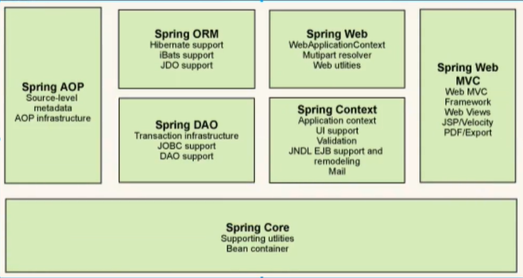
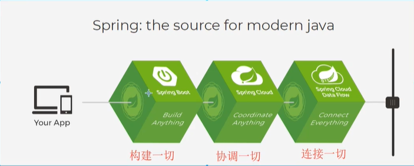

# 1. Spring

## 1.1 简介

-   Spring ---》 软件行业的春天
-   2002年， 首次推出了Spring框架的雏形， interface21框架
-   Sprint框架 以interface21框架为基础，经过重新设计，并不断丰富其内涵，于2004年3月24日，发布了1.0正式版
-   **Rod Johnson**， Spring Framework创始人，著名作者。 很难想象Rod Johnson的学历，真的让很多人大吃一惊，他是悉尼大学的博士，然而他的专业不是计算机，而是音乐学
-   Spring理念：使现有的技术更加容易使用， 本身是一个大杂烩，整合了现有的技术框架


-   SSH： Struct2 + Spring + Hibernate
-   SSM：SpringMVC + Spring + Mybatis


官网：https://spring.io/projects/spring-framework#overview

官方下载地址： https://repo.spring.io/release/org/springframework/spring/

GitHub地址： https://github.com/spring-projects/spring-framework


```xml
<dependency>
    <groupId>org.springframework</groupId>
    <artifactId>spring-webmvc</artifactId>
    <version>5.2.8.RELEASE</version>
</dependency>

<dependency>
    <groupId>org.springframework</groupId>
    <artifactId>spring-jdbc</artifactId>
    <version>5.2.8.RELEASE</version>
</dependency>
```


## 1.2 优点

-   Spring是一个免费的开源的框架（容器）！
-   Spring是一个轻量级的、非入侵式的框架！
-   **控制反转（IOC）， 面向切面编程（AOP）**
-   支持事务的处理，对框架整合的支持


==总结： **Spring就是一个轻量级的控制反转（IOC）和面向切面编程（AOP）的框架**==


## 1.3 组成




## 1.4 拓展

Spring官网介绍：现代化Java开发， 说白了就是基于Spring开发




-   Spring Boot
    -   一个快速开发的脚手架。
    -   基于SpringBoot可以快速地开发单个微服务
    -   约定大于配置
-   Spring Cloud
    -   基于SpringBoot实现的。


因为现在大多数公司都在使用SpringBoot进行快速开发，学习SpringBoot的前提，需要完全掌握Spring及SpringMVC！承上启下的作用


弊端： 发展太久之后，违背了原来的理念  配置十分繁琐， 人称：“配置地狱”


# 2. IOC理论推导

1.  UserDao 接口

    

2.  UserDaoImpl 实现类

    

3.  UserService 业务接口

    

4.  UserServiceImpl 业务实现


在我们之前的业务中，用户的需求可能会影响我们原来的代码，我们需要根据用户的需求去改变源代码！ 如果程序代码量十分大，修改一次的成本代价十分昂贵


我们使用Set接口实现，已经发生了革命性的变化

```java
private UserDao userDao;

// 利用set进行动态值的注入
public void setUserDao(UserDao userDao){
	this.userDao = userDao
}
```


-   之前，是由程序主动创建对象！控制权再程序员手上
-   使用了set注入以后，程序不再拥有创建对象的主动权，而是变为被动接收对象。


这种思想，从本质上解决了问题，程序员不用去管理对象的创建。系统的耦合性大大降低，可以更加专注于业务的实现！ 这是IOC的原型！


## IOC本质

**控制反转IOC（Inversion of Control）， 是一种设计思想， DI（依赖注入）是实现IOC的一种方法**， 也有人认为DI只是IoC的另一种说法。没有IoC的程序中，我们使用面向对象编程，对象的创建于对象间的依赖关系完全硬编码在程序中，对象的创建由程序自己控制，控制反转后将对象的创建转移给第三方，个人认为所谓的控制反转就是：获得依赖对象的方式反转了。


采用XML方式配置Bean的时候，Bean的定义信息是和现实分离的，而采用注解的方式可以把二者合为一体，Bean的定义信息直接以注解的形式定义在实现类种，从而达到了零配置的目的。


**控制反转是一种通过描述（XML或者注解）并通过第三方去生产或获取特定对象的方式。在Spring种实现控制反转的是IoC容器，其实现方式是依赖注入（Dependecy Injection， DI）**


# 3. HelloSpring

## 3.1 导入Spring相关jar包

注：Spring需要导入commons-logging进行日志记录，我们利用Maven就会自动下载对应依赖

```xml
<dependency>
    <groupId>org.springframework</groupId>
    <artifactId>spring-webmvc</artifactId>
    <version>5.2.8.RELEASE</version>
</dependency>
```


## 3.2 编写相关代码

1.  编写Hello实体类

    ```java
    public class Hello {
        private String str;
    
        public String getStr() {
            return str;
        }
    
        public void setStr(String str) {
            this.str = str;
        }
    
        @Override
        public String toString() {
            return "Hello{" +
                    "str='" + str + '\'' +
                    '}';
        }
    }
    ```

2.  编写spring文件，我们命名为beans.xml

    ```xml
    <?xml version="1.0" encoding="UTF-8"?>
    <beans xmlns="http://www.springframework.org/schema/beans"
           xmlns:xsi="http://www.w3.org/2001/XMLSchema-instance"
           xsi:schemaLocation="http://www.springframework.org/schema/beans
            https://www.springframework.org/schema/beans/spring-beans.xsd">
    <!--使用Spring来创建对象， 在Spring种都称为Bean
        bean = 对象 new Hello();
    
    -->
        <bean id="hello" class="com.kuang.pojo.Hello">
            <property name="str" value="Spring" />
        </bean>
    
    </beans>
    ```

3.  测试

    ```java
    public static void main(String[] args) {
        //获取Spring的上下文对象
        ClassPathXmlApplicationContext context = new ClassPathXmlApplicationContext("beans.xml");
        // 我们的对象现在都在Spring中管理，我们要使用，直接从里面取出来就可以了
        Hello hello = (Hello) context.getBean("hello");
        System.out.println(hello);
    
    }
    ```

思考问题：

-   Hello对象是由谁创建的？

    Hello对象是由Spring创建的

-   Hello对象的属性是怎么设置的？

    Hello对象的属性是由Spring容器设置的

这个过程就叫控制反转；

控制： 谁来控制对象创建，传统应用程序的对象是由程序本身控制创建的，使用Spring之后，对象是由Spring来创建的。

反转：程序本身不创建对象，而是变成被动的接收对象

依赖注入：就是利用set方法来进行注入

IoC是一终编程思想，由主动的编程变成被动的接受

可以通过 `new ClassPathXmlApplicationContext`去浏览底层源码

**OK, 到了现在，我们彻底不用再去程序中去改动了，要实现不同的操作，只需要在xml配置文件中进行修改，所谓的IoC， 一句话搞定：对象由Spring来创建，管理，装配。**


# 4. IoC创建对象的方式


1.  使用无参构造创建对象，默认

2.  假设我们要使用有参构造创建对象。

    1.  下标赋值

        ```xml
        <bean id="user" class="com.kuang.pojo.User">
            <constructor-arg index="0" value="我投了" />
        </bean>
        ```

    2.  通过类型创建

        ```xml
        <!--不推荐使用，如果对象中有多个同类型的就会出现错误-->
        <bean id="user" class="com.kuang.pojo.User">
        	<constructor-arg type="java.lang.String" value="42" />
        </bean>
        ```

    3.  直接通过参数名设置

        ```xml
        <bean id="user" class="com.kuang.pojo.User">
            <constructor-arg name="name" value="42" />
        </bean>
        ```


总结： 在配置文件加载的时候，容器中管理的对象就已经初始化了


# 5. Spring配置

## 5.1 别名

```xml
<!--如果我们起了别名，我们可以使用别名来获取bean（本名也可以！）-->
<alias name="user" alias="userNew" />
```

## 5.2 Bean的配置

```xml
<!--
    id: bean的唯一标识符，相当于对象名
    class：bean对象的 全限定名 ： 包名+类名
    name ： 也是别名, 而且name 可以同时取多个别名
    可以用 空格、都好、分号分隔，随意组合~
-->
    <bean id="userT" class="com.kuang.pojo.UserT" name="userT2">

    </bean>
```

## 5.3 import

一般用于团队开发使用，他可以将多个配置文件，导入合并为一个

假设，项目中有多人参与开发，这三个人负责不同的类的开发，不同的类需要注册在不同的bean中，我们可以利用import将所有人的beans.xml合并为一个总的

-   张三

-   李四

-   王五

-   applicationContext.xml

    ```xml
    <?xml version="1.0" encoding="UTF-8"?>
    <beans xmlns="http://www.springframework.org/schema/beans"
           xmlns:xsi="http://www.w3.org/2001/XMLSchema-instance"
           xsi:schemaLocation="http://www.springframework.org/schema/beans
            https://www.springframework.org/schema/beans/spring-beans.xsd">
    
        <import resource="beans.xml" />
    
    </beans>
    ```


使用的时候，直接使用总的配置就行


# 6. 依赖注入

## 6.1 构造器注入

前面说过了


## 6.2 Set方式注入[重点]

-   依赖注入：本质就是利用set方法实现注入
    -   依赖：bean对象的创建依赖于容器
    -   注入：bean对象中的所有属性，由容器来注入


环境搭建

1.  复杂类型

    ```java
    public class Address {
        private String address;
    
        public String getAddress() {
            return address;
        }
    
        public void setAddress(String address) {
            this.address = address;
        }
    }
    ```

2.  真实测试对象

    ```java
    public class Student {
        private String name;
        private Address address;
        private String[] books; 
        private List<String> hobbys;
        private Map<String, String> card;
        private Set<String> games;
        private Properties info;
        private String wift;
    }
    ```

3.  beans.xml

    ```xml
    <?xml version="1.0" encoding="UTF-8"?>
    <beans xmlns="http://www.springframework.org/schema/beans"
           xmlns:xsi="http://www.w3.org/2001/XMLSchema-instance"
           xsi:schemaLocation="http://www.springframework.org/schema/beans
            https://www.springframework.org/schema/beans/spring-beans.xsd">
    
        <bean id="Student" class="com.kuang.pojo.Student">
    <!--        普通值注入，直接用set-->
            <property name="name" value="卧槽"/>
        </bean>
    </beans>
    ```

4.  测试类

    ```java
    public class MyTest {
        public static void main(String[] args) {
            ApplicationContext context = new ClassPathXmlApplicationContext("beans.xml");
            Student student = (Student) context.getBean("Student");
            System.out.println(student.getName());
        }
    }
    ```

5.  完善注入信息

    ```xml
        <bean id="Student" class="com.kuang.pojo.Student">
    <!--    第一种：普通值注入，value-->
            <property name="name" value="卧槽"/>
    <!--    第二种,Bean注入， ref-->
            <property name="address" ref="Address" />
    <!--    第三种：数组注入，嵌套 array value-->
            <property name="books">
                <array>
                    <value>你好</value>
                    <value>hello</value>
                    <value>こんにちは！</value>
                </array>
            </property>
    <!--    第四种：列表注入， 嵌套list value-->
            <property name="hobbys">
                <list>
                    <value>听歌</value>
                    <value>看书</value>
                    <value>写代码</value>
                </list>
            </property>
    <!--    第五种：map注入， 嵌套 map entry-->
            <property name="card">
                <map>
                    <entry key="实验室" value="我透" />
                    <entry key="ID" value="123456" />
                </map>
            </property>
    <!--    第六种：Set注入， 嵌套 set value-->
            <property name="games">
                <set>
                    <value>LOL</value>
                    <value>农药</value>
                </set>
            </property>
    
    <!--    第七种：null注入，插入 null-->
            <property name="wift">
                <null />
            </property>
    <!--    第八种： property注入， 嵌套 props prop-->
            <property name="info">
                <props>
                    <prop key="wotou"> 123456</prop>
                </props>
            </property>
        </bean>
    
        <bean id="Address" class="com.kuang.pojo.Address" />
    ```

## 6.3 拓展方式注入

我们可以使用p命名空间和c命名空间完成注入


使用：

```xml
<?xml version="1.0" encoding="UTF-8"?>
<beans xmlns="http://www.springframework.org/schema/beans"
       xmlns:xsi="http://www.w3.org/2001/XMLSchema-instance"
       xsi:schemaLocation="http://www.springframework.org/schema/beans
        https://www.springframework.org/schema/beans/spring-beans.xsd"
       xmlns:p="http://www.springframework.org/schema/p"
       xmlns:c="http://www.springframework.org/schema/c">

    <!--p命令空间注入，可以直接注入属性的值：property-->
    <bean id="address" class="com.kuang.pojo.Address" />
    <bean id="user" class="com.kuang.pojo.User" p:name="老八" p:age="12" p:address-ref="address"/>

    <!--c命名空间注入， 是构造器注入-->
    <bean id="user1" class="com.kuang.pojo.User" c:age="18" c:name="我日" c:address-ref="address" />

</beans>
```

测试：

```java
    @Test
    public void pNameSpace(){
        ApplicationContext context = new ClassPathXmlApplicationContext("userbeans.xml");
        User user = context.getBean("user1", User.class);
        System.out.println(user);
    }
```

注意点：

这两种命名方式都无法直接使用，需要在xml中配置相应的属性

```
xmlns:p="http://www.springframework.org/schema/p"
xmlns:c="http://www.springframework.org/schema/c"
```

