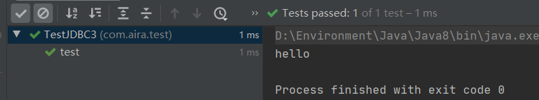

# 1. 基本概念

## 1.1 前言

web开发：

- 静态web
    - html css
    - 提供给所有人看的数据 始终不会发生变化
- 动态web
    - 淘宝，京东 几乎所有的网站
    - 提供给所有人看的数据 一直都会发生变化
    - 技术栈：Servlet/JSP， ASP， PHP


在Java中， 动态Web资源开发的技术统称为JavaWeb


## 1.2 web应用程序

Web应用程序：可以提供浏览器访问的程序

- a.html, b.html 多个web资源， 这些web资源可以被外界访问，对外界提供服务
- 浏览器可访问的文件资源，都必然存在于世界上的某一台计算机里
- URL
- 统一的Web资源都会被放在同一个文件夹下，Web应用程序 ----》 Tomcat：服务器


## 1.3 静态Web

 

静态web就是 客户端向服务器的网络服务器发送请求， 然后网络服务器在服务器本地查找资源，不管能不能查到， 都会进行响应


静态web缺点

- wen页面无法更新，所有用户呈现的东西都一样
- 无法和数据库交互（数据物法持久化，用户无法交互）


## 1.4 动态web

页面会动态展示：“Web 页面展示的效果因人而异“


缺点

- 假如服务器动态web资源出现错误，我们需要重新编写**后台程序**， 重新发布；
    - 停机维护


优点

- Web页面可以动态更新的，不同用户看到的页面不一样
- 可以和数据库交互


# 2. web服务器

## 2.1 技术讲解

ASP

- 微软：国内最早流行；
- 在HTML中嵌入VB脚本  ASP + COM；
- 在ASP开发中，基本上一个页面 都有几千行业务代码
- 维护成本高

PHP

- PHP开发速度快，功能强大，跨平台，代码简单（70）
- 无法承载大访问量（局限性）


JSP/Servlet：

B/S： 浏览器和服务器

C/S： 客户端和服务器

- sun攻击主推B/S架构
- 基于Java语言的（所有的大公司， 开源组件都基于Java）
- 可以承载三高带来的影响（高并发、高性能、高可用）
- 语法像ASP， 便于迁移到JSP， 加强市场强度


## 2.2 web服务器

服务器是一种被动操作，用来处理用户请求和给用户响应信息

**IIS**

- 微软的：可以跑ASP， Windows自带

Tomcat

面向百度编程


工作3-5年之后，可以尝试手写Tomcat服务器


# 3. Tomcat

## 3.1 Tomcat 安装


## 3.2 Tomcat启动和配置

文件夹作用


## 3.3 配置


- 可以配置端口号
- 可以配置主机名称


**高难度面试题**

网站是如何访问的：

- 输入一个域名 回车

- 检查本机的C:\Windows\System32\drivers\etc\hosts配置文件下有无域名映射：

    1. 有： 直接返回对应的ip地址，在这个地址中，由我们需要访问的web程序，可以直接访问

        ```java
        127.0.0.1   	www.aoligei.com
        ```

    2. 没有： 去DNS服务器找，找到的话返回解析结果，找不到就返回找不到

        


## 3.4 发布一个web网站

不会就先模仿

- 将自己写的网站放到tomcat指定的web应用文件夹下 webapps， 就可以访问了

- 网站应有结构

    ```java
    --webapps: Tomcat服务器web目录
        -ROOT
        -kuangshenstudy: 网站目录名
            -WEB-INF  
            	-classes： java程序
            	-lib： web应用依赖jar包
            	-web.xml: 网站配置文件
            -index.html: 默认首页
            -static
                -css 
                	-style.css
                -js
                -img
            -......
    ```

    


# 4. HTTP

## 4.1 什么是HTTP

HTTP是一个简单的请求-响应协议， 它通常运行在TCP之上。

- 文本：html， 字符串， ~
- 超文本： 图片， 音乐， 视频， 定位， 地图……
- 默认端口80

Https: 更安全

- 默认端口443


## 4.2 两个时代

- http1.0
    - http/1.0：客户端可以与web服务器连接后，只能获得一个web资源，然后就断开连接
- http2.0
    - http/1.1：客户端可以与web服务器连接后，可以获得多个web资源，然后就断开连接


## 4.3 Http请求

- 客户端 --- 发请求（Request）——服务器

    百度：

    

### 1. 请求行

- 请求行中的请求方式：**GET/POST**， HEAD，DELETE，PUT…
    - get: 能携带的参数较少，大小有限制，会在浏览器的URL地址栏显示数据内容，不安全，但是高效
    - post:请求能够携带的参数没有限制，大小没有限制，不会在浏览器的URL地址栏显示数据内容，安全，但是不高效

### 2. 消息头

- Accept：					告诉浏览器，它所支持的数据类型
- Accept-Encoding:  支持的编码格式， GBK UTF-8 GB2312 ISO8859-1
- Accept-Language: 告诉浏览器语言环境
- Cache-Control: 缓存控制
- Connection: 告诉浏览器， 请求完成是断开连接还是保持连接
- HOST：主机….

## 4.4 Http响应

- 服务器 --- 响应（Response） ---- 客户端

```java
Cache-Control: private	缓存控制
Connection: Keep-Alive	连接
Content-Encoding: gzip	编码
Content-Type: text/html	类型
```

### 1. 响应体

- Accept：					告诉浏览器，它所支持的数据类型
- Accept-Encoding:  支持的编码格式， GBK UTF-8 GB2312 ISO8859-1
- Accept-Language: 告诉浏览器语言环境
- Cache-Control: 缓存控制
- Connection: 告诉浏览器， 请求完成是断开连接还是保持连接
- HOST：主机….
- Refresh：告诉客户端，多久刷新一次
- Location: 让网页重新定位


### 2. 响应状态码

- 200： 请求响应成功
- 3**：请求重定向
    - 重定向：你重新到我给你的新位置
- 4**：找不到资源
    - 资源不存在
- 5**：服务器代码错误
    - 502： 网关错误


常见面试题

当你的浏览器中地址栏输入地址并回车到页面能展示回来，经历了什么？


# 5. Maven


# 6. Servlet

## 6.1 什么是Servlet

- Servlet就是sun公司开发动态web的一门技术
- Sun再这些API中提供了一个接口叫做：Servlet， 如果你想开发一个Servlet程序，只需要完成两个小步骤：
    - 编写一个类，实现Servlet接口
    - 把开发好的Java类部署到Web服务器中

**把实现了Servlet接口的Java程序叫做，Servlet**


## 6.2 Hello Servlet

Servlet接口再Sun公司有两个实现类：HttpServlet 和 GenericServlet接口

1. 构建一个普通的Maven项目，删掉里面的src目录，以后我们就在这里面建立Module， 这个空的工程就是Maven主工程；

2. 关于Maven父子工程的理解：

    - 父项目会有

        ```xml
        <modules>
            <module>servlet001</module>
        </modules>
        ```

    - 子项目会有

        ```xml
        <parent>
            <artifactId>servlet01</artifactId>
            <groupId>org.example</groupId>
            <version>1.0-SNAPSHOT</version>
        </parent>
        ```

        父项目中的jar包子项目可以直接使用

        `son extend father`

3. Maven环境优化

    1. 修改web.xml为最新的
    2. 将maven的结构搭建完整

4. 编写一个Servlet程序

    1. 编写一个普通类
    2. 实现一个Servlet接口，这里我们直接继承HttpServlet类，并且重写doGet和doPost方法

5. 编写Servlet映射

    为什么需要映射：我们写的是Java程序，但是要通过浏览器访问，而浏览器需要连接web服务器，所以我们需要在web服务中注册我们写的Servlet，还需要给他一个浏览器能够访问的路径；

    ```xml
    <!-- 注册Servlet -->
    <servlet>
    	<servlet-name>hello</servlet-name>
    	<servlet-class>com.aira.servlet.HelloServlet</servlet-class>
    </servlet>
    <!--Servlet的请求路径-->
    <servlet-mapping>
        <servlet-name>hello</servlet-name>
        <url-pattern>/hello</url-pattern>
    </servlet-mapping>
    ```
6. 配置Tomcat

    注意：配置项目发布的路径

7. 启动测试


## 6.3 Servlet原理

Servlet是由Web服务器调用，web服务器在收到浏览器


## 6.4 Mapping映射

1. 一个Servlet可以指定一个映射路径

    ```xml
    <servlet-mapping>
        <servlet-name>hello</servlet-name>
        <url-pattern>/hello</url-pattern>
    </servlet-mapping>
    ```

2. 一个Servlet可以指定多个映射路径

    ```XML
    <servlet-mapping>
        <servlet-name>hello</servlet-name>
        <url-pattern>/hello1</url-pattern>
    </servlet-mapping>
    <servlet-mapping>
        <servlet-name>hello</servlet-name>
        <url-pattern>/hello2</url-pattern>
    </servlet-mapping>
    <servlet-mapping>
        <servlet-name>hello</servlet-name>
        <url-pattern>/hello3</url-pattern>
    </servlet-mapping>
    ```

3. 一个Servlet可以指定通用映射路径

    ```xml
    <servlet-mapping>
        <servlet-name>hello</servlet-name>
        <url-pattern>/hello/*</url-pattern>
    </servlet-mapping>
    ```

4. 默认请求路径

    ```xml
    <servlet-mapping>
        <servlet-name>hello</servlet-name>
        <url-pattern>/*</url-pattern>
    </servlet-mapping>
    ```

5. 指定一些后缀或者前缀等等

    ```xml
    <!--可以自定义后缀实现请求映射
    	注意：* 的前面不能加项目映射的路径
    	hello/sdalksdjals.do
    -->
    <servlet-mapping>
        <servlet-name>hello</servlet-name>
        <url-pattern>*.do</url-pattern>
    </servlet-mapping>
    ```

6. 优先级问题

    指定了固有的映射路径优先级最高，如果找不到就会走默认的处理结果；


## 6.5 ServletContext

web容器在启动的时候，会为每个Web程序都创建一个对应的ServletContext对象，它代表了当前的Web应用：

### 1. 共享数据

在一个Servlet保存的数据，可以在另外一个Servlet中取到

写ServletContext的类

```java
public class HelloServlet extends HttpServlet {
    @Override
    protected void doGet(HttpServletRequest req, HttpServletResponse resp) throws ServletException, IOException {
        System.out.println("Hello");
//        this.getInitParameter();  初始化参数
//        this.getServletConfig();  Servlet配置
//        this.getServletContext(); Servlet上下文
        ServletContext context = this.getServletContext();
        String username = "laoba";
        context.setAttribute("username", username); // 将一个数据保存在了ServletContext中，名字为username， 值为 username
    }
    @Override
    protected void doPost(HttpServletRequest req, HttpServletResponse resp) throws ServletException, IOException {
        super.doPost(req, resp);
    }
}
```

读ServletContext的类

```java
public class getServlet extends HttpServlet {
    @Override
    protected void doGet(HttpServletRequest req, HttpServletResponse resp) throws ServletException, IOException {
        ServletContext context = this.getServletContext();
        String username = (String)context.getAttribute("username");
        resp.getWriter().print(username);
    }

    @Override
    protected void doPost(HttpServletRequest req, HttpServletResponse resp) throws ServletException, IOException {
        super.doPost(req, resp);
    }
}
```

Servlet配置

```xml
<servlet>
    <servlet-name>hello</servlet-name>
    <servlet-class>com.aira2.servlet.HelloServlet</servlet-class>
</servlet>
<servlet-mapping>
    <servlet-name>hello</servlet-name>
    <url-pattern>/hello</url-pattern>
</servlet-mapping>

<servlet>
    <servlet-name>get</servlet-name>
    <servlet-class>com.aira2.servlet.getServlet</servlet-class>
</servlet>
<servlet-mapping>
    <servlet-name>get</servlet-name>
    <url-pattern>/get</url-pattern>
</servlet-mapping>
```


### 2. 获取初始化参数

```xml
<context-param>
    <param-name>url</param-name>
    <param-value>jdbc:mysql://localhost:3306</param-value>
</context-param>
```

```java
protected void doGet(HttpServletRequest req, HttpServletResponse resp) throws ServletException, IOException {
	ServletContext context = this.getServletContext();
	String url = context.getInitParameter("url");
	resp.getWriter().print(url);
}
```


### 3. 请求转发

```java
protected void doGet(HttpServletRequest req, HttpServletResponse resp) throws ServletException, IOException {
	ServletContext context = this.getServletContext();
	System.out.println("进入了ServletDeno04");
//RequestDispatcher requestDispatcher = context.getRequestDispatcher("/gp"); // 转发的请求路径
//requestDispatcher.forward(req, resp); // 调用forward实现请求转发;
   	context.getRequestDispatcher("/gp").forward(req, resp);
}
```

**请求转发与重定向的区别**


### 4. 读取资源文件 properties

- 在Java目录下新建Properties
- 在resources目录下新建properties

发现：都被打包到了同一个路径下：classes, 我们俗称这个路径为classpath

思路： 需要一个文件流

```properties
username = root
password = 123456
```

```java
protected void doGet(HttpServletRequest req, HttpServletResponse resp) throws ServletException, IOException {
	InputStream is = this.getServletContext().getResourceAsStream("/WEB-INF/classes/db.properties");
	Properties properties = new Properties();
    properties.load(is);
    String username = properties.getProperty("username");
    String password = properties.getProperty("password");
    
    resp.getWriter().print(username + ": " + password);
}
```

如果读取不到，可以在pom文件下给build配置resources

```xml
<build>
	<resources>
	  <resource>
	    <directory>src/main/resources</directory>
	    <includes>
	      <include>**/*.properties</include>
	      <include>**/*.xml</include>
	    </includes>
	    <filtering>true</filtering>
	  </resource>
	  <resource>
        <!--这样java下面的properties和xml文件都可以被导出了-->
	    <directory>src/main/java</directory>
	    <includes>
	      <include>**/*.properties</include>
	      <include>**/*.xml</include>
	    </includes>
	    <filtering>true</filtering>
	  </resource>
	</resources>
</build>
```


## 6.6 HttpServletResponse

web服务器接收到客户端的http请求，针对这个请求，会 分别创建一个代表请求的HttpServletRequest对象，代表相应的HttpServletResponse对象；

- 如果要获取客户端请求过来的参数：找HttpServletRequest；
- 如果要给客户端响应一些信息：找HttpServletResponse；

### 1. 简单分类

**负责向浏览器发送数据的方法**

```java
ServletOutputStream getOutputStream() throws IOException;

PrintWriter getWriter() throws IOException;
```

**负责向浏览器发送响应头的方法**

```java
void setCharacterEncoding(String var1);

void setContentLength(int var1);

void setContentType(String var1);

void setDateHeader(String var1, long var2);

void addDateHeader(String var1, long var2);

void setHeader(String var1, String var2);

void addHeader(String var1, String var2);

void setIntHeader(String var1, int var2);

void addIntHeader(String var1, int var2);
```

响应的状态码

```java
int SC_CONTINUE = 100;
int SC_SWITCHING_PROTOCOLS = 101;
int SC_OK = 200;
int SC_CREATED = 201;
int SC_ACCEPTED = 202;
int SC_NON_AUTHORITATIVE_INFORMATION = 203;
int SC_NO_CONTENT = 204;
int SC_RESET_CONTENT = 205;
int SC_PARTIAL_CONTENT = 206;
int SC_MULTIPLE_CHOICES = 300;
int SC_MOVED_PERMANENTLY = 301;
int SC_MOVED_TEMPORARILY = 302;
int SC_FOUND = 302;
int SC_SEE_OTHER = 303;
int SC_NOT_MODIFIED = 304;
int SC_USE_PROXY = 305;
int SC_TEMPORARY_REDIRECT = 307;
int SC_BAD_REQUEST = 400;
int SC_UNAUTHORIZED = 401;
int SC_PAYMENT_REQUIRED = 402;
int SC_FORBIDDEN = 403;
int SC_NOT_FOUND = 404;
int SC_METHOD_NOT_ALLOWED = 405;
int SC_NOT_ACCEPTABLE = 406;
int SC_PROXY_AUTHENTICATION_REQUIRED = 407;
int SC_REQUEST_TIMEOUT = 408;
int SC_CONFLICT = 409;
int SC_GONE = 410;
int SC_LENGTH_REQUIRED = 411;
int SC_PRECONDITION_FAILED = 412;
int SC_REQUEST_ENTITY_TOO_LARGE = 413;
int SC_REQUEST_URI_TOO_LONG = 414;
int SC_UNSUPPORTED_MEDIA_TYPE = 415;
int SC_REQUESTED_RANGE_NOT_SATISFIABLE = 416;
int SC_EXPECTATION_FAILED = 417;
int SC_INTERNAL_SERVER_ERROR = 500;
int SC_NOT_IMPLEMENTED = 501;
int SC_BAD_GATEWAY = 502;
int SC_SERVICE_UNAVAILABLE = 503;
int SC_GATEWAY_TIMEOUT = 504;
int SC_HTTP_VERSION_NOT_SUPPORTED = 505;
```

### 2. 常见应用

1. 像浏览器输出消息

2. 下载文件

    1. 要获取下载文件的路径
    2. 下载的文件名是什么
    3. 设置想办法让浏览器能够支持下在我们需要的东西
    4. 获取下载文件的输入流
    5. 创建缓冲区
    6. 获取OutputStream对象
    7. 将FileOutputStream流写入buffer缓冲区
    8. 使用OutputStream将缓冲区中的数据输出到客户端

    ```java
    protected void doGet(HttpServletRequest req, HttpServletResponse resp) throws ServletException, IOException {
    //        1. 要获取下载文件的路径
    	String realPath = this.getServletContext().getRealPath("/1.png");
    	System.out.println("下载文件路径：" + realPath);
    //        2. 下载的文件名是什么
    	String fileName = realPath.substring(realPath.lastIndexOf("\\") + 1);
    //        3. 设置想办法让浏览器能够支持下在我们需要的东西, 中文文件名用URLEncoder.encode编码，否则可能乱码
    	resp.setHeader("Content-Disposition", "attachment; filename=" + URLEncoder.encode(fileName, "UTF-8"));
    //        4. 获取下载文件的输入流
        FileInputStream in = new FileInputStream(realPath);
    //        5. 创建缓冲区
        int len=0;
        byte[] buffer = new byte[1024];
    //        6. 获取OutputStream对象
        ServletOutputStream out = resp.getOutputStream();
    //        7. 将FileOutputStream流写入buffer缓冲区,使用OutputStream将缓冲区中的数据输出到客户端
        while(in.read(buffer) > 0){
            out.write(buffer, 0, len);
         }
         in.close();
         out.close();
    }
    ```

    ### 3. 验证码功能

    验证如何实现

    - 前端实现
    - 后端实现，需要用到Java的图片类，生产一个图片

    ```java
    protected void doGet(HttpServletRequest req, HttpServletResponse resp) throws ServletException, IOException {
    
            // 如何让浏览器五秒自动刷新一次
            resp.setHeader("refresh", "3");
    
            // 在内存中创建一个图片
            BufferedImage image = new BufferedImage(80, 80, BufferedImage.TYPE_3BYTE_BGR);
    
            // 得到图片
            Graphics2D g = (Graphics2D) image.getGraphics(); // 笔
    
            //设置图片背景颜色
            g.setColor(Color.white);
            g.fillRect(0, 0, 80, 20);
    
            // 给图片写数据
            g.setColor(Color.BLUE);
            g.setFont(new Font(null, Font.BOLD, 20));
            g.drawString(makeNum(), 0, 20);
    
            //告诉浏览器，这个请求用图片的方式打开
            resp.setContentType("image/jpg");
            //浏览器存在缓存，不让浏览器缓存
            resp.setDateHeader("expires", -1);
            resp.setHeader("Cache-Control", "no-cache");
            resp.setHeader("Pragma", "no-cache");
    
            // 把图片写给浏览器
            ImageIO.write(image, "jpg" ,resp.getOutputStream());
        }
    
        // 生成随机数
        private String makeNum(){
            Random random = new Random();
            String num = random.nextInt(9999999) + "";
            StringBuffer sb = new StringBuffer();
            for (int i = 0; i< 7 - num.length(); i++){
                sb.append("0");
            }
            num = sb.toString() + num;
            return num;
        }
    ```

    ### 4. 实现重定向

    一个Web资源收到客户点请求之后，他会通知客户端去访问另外一个Web资源，这个过程叫做重定向

    常见场景：

    - 用户登录

        ```java
        void sendRedirect(String var1) throws IOException;
        ```

        测试：

        ```java
        protected void doGet(HttpServletRequest req, HttpServletResponse resp) throws ServletException, IOException {
                    // 等价于
        //        resp.setHeader("Location", "/r/img");
        //        resp.setStatus(302);
        	resp.sendRedirect("/response_war/img");
        }
        ```

    - 面试题： 请你聊聊重定向和转发的区别

        相同点

        - 页面都会实现跳转

        不同点

        - 请求转发的时候，url不会发生变化
        - 重定向的时候，url会发生变化

## 6.7 HttpServletRequest

HttpServletRequest代表客户端的请求，用户通过Http协议访问服务器，Http请求中所有信息都会被封装到HttpServletRequest，通过这个HttpServletRequest的方法，获得客户端的所有信息


### 1. 获取前端传递参数、请求转发


```java
    protected void doGet(HttpServletRequest req, HttpServletResponse resp) throws ServletException, IOException {
        req.setCharacterEncoding("utf-8");
        resp.setCharacterEncoding("utf-8");

        String username = req.getParameter("username");
        String password = req.getParameter("password");
        String[] hobbys = req.getParameterValues("hobbys");
        System.out.println("==================================");
        // 后台接收中文乱码问题
        System.out.println(username);
        System.out.println(password);
        System.out.println(Arrays.toString(hobbys));
        System.out.println("==================================");

        System.out.println(req.getContextPath());
        // 这里的 / 代表当前的web应用
        req.getRequestDispatcher("/success.jsp").forward(req, resp);

    }
```

- 面试题： 请你聊聊重定向和转发的区别

    相同点

    - 页面都会实现跳转

    不同点

    - 请求转发的时候，url不会发生变化
    - 重定向的时候，url会发生变化
    - 请求转发只能转发到当前web资源下
    - 重定向可以定向到任意web资源


# 7. Cookie、Session


## 7.1 会话 Session

**会话**：用户打开了一个浏览器，点击了很多超链接，访问了很多web资源，关闭浏览器，这个过程可以成为会话

**有状态会话**：我们访问过一个网站，下次再次访问这个网站，服务器端之后你曾经来过；

**一个网站如何证明你来过？**

客户端 			服务器端

1. 服务器给客户一个 **信件**， 客户端下次访问服务器端带上新建就可以了； cookie
2. 服务器端等级你来过了，下次你来的时候，我来匹配你；session


## 7.2 保存会话的两种技术

**cookie**

- 客户端技术（响应，请求）

**session**

- 服务器技术，利用这个技术，可以保存用户的会话信息？ 我们可以把信息或数据放入Session中


常见例子：网站登录之后，下次就不用再登陆了，第二次登录就不用登陆了


## 7.3 Cookie


1. 从请求中拿到Cookie信息 
2. 服务端响应给客户端cookie

```java
Cookie[] cookies = req.getCookies(); // 获得Cookie
cookie.getName(); //获得cookie中的key
cookie.getValue(); //获得cookie中的值
new Cookie("lastLoginTime", System.currentTimeMillis() + ""); //新建一个cookie
cookie.setMaxAge(24*60*60); // 设置cookie的有效期
resp.addCookie(cookie); // 响应cookie给客户端
```


**cookie：一般会保存在本地的用户目录下 appdata；**


一个网站cookie是否存在上限？

- 一个Cookie只能保存一个信息
- 一个Web站点可以给浏览器多个cookie，一个站点最多存放20个
- Cookie大小有限制为4kb
- 浏览器上限为300个cookie


删除Cookie：

- 不设置有效期，关闭浏览器，自动失效
- 设置有效期时间为0


解决网络传输过程中乱码问题

解码编码

```java
URLEncoder.encode("快乐","utf8");
URL.decode(cookie.getValues(), "utf-8");
```


## 7.4 Session（重点）


什么是session？

- 服务器会给用户（浏览器）创建一个session对象
- 一个Session独占一个浏览器，只要浏览器没有关闭，这个Session就存在；
-   用户登陆之后，整个网站都可以访问；


Session和cookie区别

- Cookie是把用户的数据写给用户的浏览器，浏览器负责保存（可以保存多个）
- Session是把用户的数据写到用户独占Session中，服务器保存（保存重要的信息，减少服务器资源浪费）
- Session对象由服务器创建


使用场景：

- 保存一个登录用户的信息；
- 购物车信息；
- 在整个网站中，经常会使用的数据，我们将它保存在Session中；


> 获取Session并写入数据

```java
package com.aira.servlet;

import com.aira.pojo.Person;

import javax.servlet.ServletException;
import javax.servlet.http.*;
import java.io.IOException;

public class SessionDemo01 extends HttpServlet {
    @Override
    protected void doGet(HttpServletRequest req, HttpServletResponse resp) throws ServletException, IOException {

        // 解决乱码问题
        resp.setCharacterEncoding("utf-8");
        req.setCharacterEncoding("utf-8");
        resp.setContentType("text/html; charset=utf-8");
        //得到Session
        HttpSession session = req.getSession();
        // 给Session存入数据
        session.setAttribute("name", new Person("jojo", 20));

        //获取Session的id
        String id = session.getId();

        //判断session是不是新的
        if (session.isNew()){
            resp.getWriter().write("Session创建成功，ID：" + id);
        }else {
            resp.getWriter().write("Session在服务器已存在，ID：" + id);
        }

        //Session创建的时候做了什么事情
//        对于Sessionid来说，它更像一个cookie，并且确实是以session的形式发送给浏览器的
//        Cookie cookie = new Cookie("JSESSIONID", id);
//        resp.addCookie(cookie);
    }

    @Override
    protected void doPost(HttpServletRequest req, HttpServletResponse resp) throws ServletException, IOException {
        doGet(req, resp);
    }
}

```


> 获取Session并读取数据

```java
    protected void doGet(HttpServletRequest req, HttpServletResponse resp) throws ServletException, IOException {

        // 解决乱码问题
        resp.setCharacterEncoding("utf-8");
        req.setCharacterEncoding("utf-8");
        resp.setContentType("text/html; charset=utf-8");
        //得到Session
        HttpSession session = req.getSession();

        Person person = (Person)session.getAttribute("name");
        System.out.println(person.toString());

    }
```


> 手动注销Session

```java
protected void doGet(HttpServletRequest req, HttpServletResponse resp) throws ServletException, IOException {
    HttpSession session = req.getSession();
    session.removeAttribute("name");
    //手动注销Session
    session.invalidate();
}
```


> xml配置Session失效时间(自动过期)

```xml
<!--    设置Session默认失效时间-->
    <session-config>
<!--        15分钟后session自动失效， 以分钟为单位-->
        <session-timeout>15</session-timeout>
    </session-config>
```


> 共用资源存入ServletContext


# 8. JSP

## 8.1 什么是JSP

Java Server Pages： Java服务器端页面， 也和Servlet一样，用于开发动态Web

最大的特点：

- 写JSP就像在写HTML
- 区别：
    - HTML只给用户提供静态的数据
    - JSP页面可以嵌入Java代码，为用户提供动态数据。


## 8.2 JSP原理

思路： JSP到底怎么执行的

- 代码层面没有任何问题

- 服务器内部工作

    tomcate中有一个work目录：

    IDEA中使用Tomcat的会在IDEA的Tomcat中产生一个work目录

    页面会转变成了Java程序

**浏览器向服务器发送请求，不管访问什么资源，其实都是在访问Servlet**

JSP最终会被转换成为一个Java类


**JSP本质上就是一个Servlet**


```java
//初始化
public void _jspInit() {
}
//销毁
public void _jspDestroy() {
}
//JSP Service
public void _jspService(HttpServletRequest request, HttpServletResponse response)
```

1. 判断请求

2. 内置一些对象

    ```java
    final javax.servlet.jsp.PageContext pageContext; // 页面上下文
    javax.servlet.http.HttpSession session = null;	//session
    final javax.servlet.ServletContext application;	// applicationContext
    final javax.servlet.ServletConfig config;	// config
    javax.servlet.jsp.JspWriter out = null; // out
    final java.lang.Object page = this;	// page当前页
    HttpServletRequest request 			//请求
    HttpServletResponse response		//响应
    ```

3. 输出页面前增加的代码

    ```java
    response.setContentType("text/html; charset=UTF-8"); // 当前响应页面类型
    pageContext = _jspxFactory.getPageContext(this, request, response,null, false, 8192, true);
    _jspx_page_context = pageContext;
    application = pageContext.getServletContext();
    config = pageContext.getServletConfig();
    out = pageContext.getOut();
    _jspx_out = out;
    ```

    以上的对象，我们可以在JSP页面中直接使用！好多Servlet对象


在JSP页面中

只要是Java代码，就会原封不动地输出

如果是HTML代码，就会被转换为

```java
out.write("<html>\r\n");
```

这样的格式，输出给前端


## 8.3 JSP基础语法

任何语言都有自己的语法，Java中有，JSP作为Java技术的一种应用，它拥有一些自己扩充的语法（了解，知道即可）， Java所有语法都支持


JSP表达式

```jsp
<%--JSP表达式
  作用：用来将程序输出到客户端
  <%= 变量或表达式%>
--%>
<%= new java.util.Date()%>
```


JSP脚本片段

```jsp
<%--  JSP脚本片段--%>
  <%
    int sum = 0;
    for (int i = 0; i<100; i++){
      sum+=i;
    }
    out.print("<h1>Sum="+sum+"</h1>");
  %>
```


脚本片段再实现

```jsp
  <%
  for(int i=0; i<5; i++){

  %>
    <h1>Hello,World <%=i%></h1>
  <%
  }
  %>
```


JSP声明

```jsp
  <%!
    static {
      System.out.println("Loading Servlet!");
    }

    private int globarVar = 0;
    public void kuang(){
      System.out.println("进入了方法kuang");
    }
  %>
```


JSP声明：会被编译到JSP生成的Java的类中！其他的，就会被生成到jspService方法中！


在JSP中，嵌入Java代码即可！

```jsp
<%%>
<%=%>
<%!%>

<%--注释--%>
```

JSP的注释不会在客户端显示，HTML的会显示


## 8.4 JSP指令

```jsp
<%@page args...%>
<%@include file=""%>

<%--
    @include会将两个页面合并为一个
    --%>
<%@include file="...."%>
<h1>
    网页主体
</h1>
<%@include file="...."%>


<%--
   jsp标签
   jsp：include： 拼接页面，本质还是三个 
   --%>
<jsp:include page=".....">
<h1>
    网页主体
</h1>
<jsp:include page=".....">
```


## 8.5 9大内置对象

- PageContext 存东西
- Request 存东西
- Response
- Session 存东西
- Application 【ServletContext】 存东西
- config 【ServletConfig】
- out
- page， 几乎不用
- exception


```java
pageContext.setAttribute("name1", "卧槽泥马");  // 保存的数据只在一个页面中有效
request.setAttribute("name2", "卧槽二号");      // 保存的数据只会在一次请求中有效，请求转发会携带这个数据
session.setAttribute("name3", "卧槽三号");      // 保存的数据只在一次会话中有效， 从浏览器打开到关闭浏览器
application.setAttribute("name4", "卧槽四号");  // 保存的数据只在服务器中有效， 从打开服务器，到关闭服务器
```

request: 客户端向服务器发送请求，产生的数据，看完就没用了， 比如：新闻，用户看完没用

session：客户端向服务器发送请求，产生的数据，用户用完一会还会用，比如：服务器；

application：客户端向服务器发送请求，产生的数据，一个用户用完了，其他用户还可能使用，比如：聊天数据；


## 8.6 JSP标签、JSTL标签、EL表达式

EL表达式：${}

- **获取数据**
- **执行运算**
- **获取web开发的常用对象**
- 调用java方法


JSP标签：

```jsp
<%--<jsp:include page=""></jsp:include>--%>
<jsp:forward page="/jsptag2.jsp">
    <jsp:param name="value1" value="value1"/>
    <jsp:param name="value2" value="value2"/>
</jsp:forward>
```


JSTL表达式

JSTL标签的使用就是为了弥补HTML标签的不足； 它自定义许多标签，可以供我们使用，标签的功能和Java代码一样


**格式化标签**

**SQL标签**

**XML标签**

**核心标签**（掌握部分）


JSTL标签库使用步骤

- 引入对用的taglib
- 使用其中的方法
- **Tomcat也需要引入jstl的包，否则会报错：JSTL解析错误**


> c:if

```jsp
<form action="coreif.jsp" method="get">
<%--    EL表达式获取表单数据 ${param。参数名}--%>
    <input type="text" name="username" value="${param.username}">
    <input type="submit" value="登录">
</form>
<%--如果提交的用户名是管理员，则登陆成功--%>
<c:if test="${param.username == 'admin'}" var="isAdmin">
    <c:out value="管理员欢迎你" />
</c:if>
<c:out value="${isAdmin}" />
```

> c:choose

```jsp
<c:set var="score" value="87" />
<c:choose>
    <c:when test="${score >= 90}">
        你的成绩优秀
    </c:when>
    <c:when test="${score >= 80}">
        你的成绩良好
    </c:when>
    <c:when test="${score >= 70}">
        你的成绩一般
    </c:when>
    <c:when test="${score >= 60}">
        你的成绩及格
    </c:when>
    <c:when test="${score < 60}">
        你的成绩不好
    </c:when>
</c:choose>
```

> c:foreach

```jsp
<%
    ArrayList<String> strings = new ArrayList<>();
    strings.add(0, "wocao");
    strings.add(1, "张三");
    strings.add(2, "李四");
    strings.add(3, "王五");
    strings.add(4, "赵六");

    request.setAttribute("list", strings);
%>
<%--var， 每一次遍历出来的变量
    items， 要遍历的对象--%>
<c:forEach var="people" items="${list}">
    <c:out value="${people}" />
</c:forEach>

<c:forEach var="people" items="${list}" begin="1" end="3" step="2">
    <c:out value="${people}" />
</c:forEach>
```


# 9. JavaBean

实体类

JavaBean有特定的写法

- 必须有一个无参构造
- 属性必须私有化
- 必须有对应的get/set方法

一般用来做数据库的字段做映射 ORM

ORM：对象关系映射

- 表---> 类
- 字段---> 属性
- 行记录 ----> 对象

| id   | name | age  | address |
| ---- | ---- | ---- | ------- |
| 1    | 老七 | 3    | 天津    |
| 2    | 老八 | 50   | 上海    |
| 3    | 老九 | 220  | 河南    |

```java
class People{
    private int id;
    private String name;
    private int age;
    private String address;
}
```


# 10. MVC三层架构

什么是MVC： Model View Controller 模型、 视图、控制器


## 10.1 早些年


用户直接访问控制层，控制层可以直接操作数据库；

```java
servlet -- CRUD --> 数据库;
弊端： 程序十分臃肿，不利于维护;
Servlet的代码中: 处理请求、响应、视图跳转、处理JDBC、处理业务代码、处理逻辑代码;
    
架构: 没有什么事加一层解决不了的;

程序员调用
|
JDBC
|
各种各样的数据库
```

## 10.2 MVC三层架构


Model

- 业务处理： 业务逻辑（Service）
- 数据持久化层：CRUD（Dao）

View

- 展示数据
- 提供链接发起ervlet请求（a, form, img…）

Controller

- 接受用户的请求：（req: 请求的参数、Session信息….）
- 交给业务层处理对应的代码
- 控制视图跳转

```java
登录---> 接受用户的登录请求--->处理用户的请求（调用用户登陆的参数，username，password）----> 交给业务层处理登陆业务（判断用户名密码是否正确：十五） ---> Dao层查询用户名和密码是否正确----> 数据库
```


# 11. Filter(重点)

Filter: 过滤器， 用来过滤网站的数据；

- 处理中文乱码
- 登陆验证 


Filter开发步骤：

- 导包
- 编写过滤器
    - 导包不要导错
    
    - 实现Filter接口，重写对应方法
    
    - ```java
      public void init(FilterConfig filterConfig) throws ServletException {
        System.out.println("初始化");
      }
      
        //Chain: 链
        /*
        * 1. 过滤所有代码，再过滤特定请求的时候都会执行
        * 2. 必须让过滤器继续通行
        * filterChain.doFilter(servletRequest, servletResponse);
        * */
        public void doFilter(ServletRequest servletRequest, ServletResponse servletResponse, FilterChain filterChain) throws IOException, ServletException {
            servletRequest.setCharacterEncoding("utf-8");
            servletResponse.setCharacterEncoding("utf-8");
            servletResponse.setContentType("text/html;charset=UTF-8");
      
            System.out.println("执行前");
            filterChain.doFilter(servletRequest, servletResponse); // 让我们的请求继续走，如果不写，程序到这里就终止了
            System.out.println("执行后");
        }
      //     销毁:服务器关闭的时候销毁
        public void destroy() {
            System.out.println("销毁");
        }
      ```
      
    - 在web.xml中配置Filter
    
    - ```xml
            <filter>
                <filter-name>CharacterEncodingFilter</filter-name>
                <filter-class>com.aira.filter.CharacterEncodingFilter</filter-class>
            </filter>
            <filter-mapping>
                <filter-name>CharacterEncodingFilter</filter-name>
                <url-pattern>/servlet/*</url-pattern>
        <!--        <url-pattern>/*</url-pattern>-->
            </filter-mapping>
        ```
    


# 12. 监听器

实现一个监听的接口（有N种）

1. 编写一个监听器

    实现监听器的接口

    ```java
    public class OnlineCountListener implements HttpSessionListener {
        // 创建Session监听： 看你的一举一动
        public void sessionCreated(HttpSessionEvent httpSessionEvent) {
            ServletContext ctx = httpSessionEvent.getSession().getServletContext();
            System.out.println(httpSessionEvent.getSession().getId());
            Integer onlineCount = (Integer) ctx.getAttribute("OnlineCount");
            if (onlineCount == null){
                onlineCount = 1;
            }else {
                onlineCount ++;
            }
    
            ctx.setAttribute("OnlineCount", onlineCount);
        }
        // 销毁session监听
        // 一单Session销毁就会触发这个函数
        public void sessionDestroyed(HttpSessionEvent httpSessionEvent) {
            ServletContext ctx = httpSessionEvent.getSession().getServletContext();
            Integer onlineCount = (Integer) ctx.getAttribute("OnlineCount");
            if (onlineCount == null){
                onlineCount = 0;
            }else {
                onlineCount --;
            }
    
            ctx.setAttribute("OnlineCount", onlineCount);
        }
    
        /*
        * Session销毁：
        * 1. 手动销毁 getSession().invalidate();
        * 2. 自动销毁
        * */
    }
    ```

    

2. web.xml中注册监听器

    ```xml
    <listener>
    	<listener-class>com.aira.listener.OnlineCountListener</listener-class>
    </listener>
    ```

3. 看情况是否使用！


# 13. 过滤器、监听器常见应用


用户登陆之后才能进入主页，用户注销之后就不能进入主页

1. 用户登陆之后，向Session中放入用户的数据

2. 进入主页的时候要判断用户是否已经登录；要求：在过滤器中实现

    ```java
    HttpServletRequest request = (HttpServletRequest) servletRequest;
    HttpServletResponse response = (HttpServletResponse) servletResponse;
    System.out.println("过滤直接访问主页操作");
    if (request.getSession().getAttribute("USER_SESSION") == null){ 			response.sendRedirect(request.getContextPath()+"/login.jsp");
    }
    
    filterChain.doFilter(request, response);
    ```

    

# 14. JDBC

什么是JDBC： Java Database connector

需要的jar包

- java.sql
- javax.sql
- mysql-connecter-java…. （连接驱动必须导入）


实验环境搭建


导入数据库依赖

```xml
<dependency>
    <groupId>mysql</groupId>
    <artifactId>mysql-connector-java</artifactId>
    <version>5.1.47</version>
</dependency>
```

IDEA中连接数据库

```java
public static void main(String[] args) throws ClassNotFoundException, SQLException {
        String url = "jdbc:mysql://localhost:3306/jdbc?useUnicode=true&characterEncoding=utf-8";
        String username  = "root";
        String password = "123456";

        // 1. 加载驱动
        Class.forName("com.mysql.jdbc.Driver");

        //2. 连接数据库, 代表数据库
        Connection connection = DriverManager.getConnection(url, username, password);

        // 3. 向数据库发送SQL的对象Statement
        Statement statement = connection.createStatement();

        // 4. 编写SQL
        String sql = "select * from users;";

        // 5. 执行查询，返回查询结果
        ResultSet resultSet = statement.executeQuery(sql);

        while (resultSet.next()){
            System.out.println("id=" + resultSet.getInt("id"));
            System.out.println("name=" + resultSet.getString("name"));
            System.out.println("password" + resultSet.getString("password"));
            System.out.println("email=" + resultSet.getString("email"));
            System.out.println("birthday=" + resultSet.getObject("birthday"));
        }

        // 6. 关闭连接，释放资源
        resultSet.close();
        statement.close();
        connection.close();
    }
```

JDBC固定步骤：

1. 加载驱动
2. 链接数据库
3. 向数据库发送SQL的对象Statement
4. 编写SQL
5. 执行SQL，并返回查询结果
6. 关闭连接，释放资源


预编译SQL

```java
    public static void main(String[] args) throws ClassNotFoundException, SQLException {
        String url = "jdbc:mysql://localhost:3306/jdbc?useUnicode=true&characterEncoding=utf-8";
        String username  = "root";
        String password = "123456";

        // 1. 加载驱动
        Class.forName("com.mysql.jdbc.Driver");

        //2. 连接数据库, 代表数据库
        Connection connection = DriverManager.getConnection(url, username, password);

        // 3. 编写SQL
        String sql = "insert into users(id, `name`, `password`, `email`, `birthday`) value (?, ?, ?, ?, ?)";

        // 4. 预编译SQL
        PreparedStatement preparedStatement = connection.prepareStatement(sql);

        preparedStatement.setInt(1, 3);
        preparedStatement.setString(2, "奥里给");
        preparedStatement.setString(3, "123456");
        preparedStatement.setString(4, "alg@qq.com");
        preparedStatement.setDate(5, new Date(new java.util.Date().getTime()));

        // 5. 执行SQL
        int i = preparedStatement.executeUpdate();
        if(i > 0){
            System.out.println("插入成功");
        }else {
            System.out.println("插入失败");
        }

        // 6. 关闭连接 释放资源

        preparedStatement.close();
        connection.close();

    }
```


**事务**

要么都成功，要么都失败！

ACID原则:保证数据的安全

```java
开启事务
事务提交 commit（）
事务回滚 rollback（）
关闭事务
```


**Junit单元测试**

依赖

```xml
<dependency>
    <groupId>junit</groupId>
    <artifactId>junit</artifactId>
    <version>4.12</version>
</dependency>
```

简单使用

@Testt注解只在方法上有效，只要加了这个注解的方法，就可以直接运行

```java
@Test
public void test(){
    System.out.println("hello");
}
```



